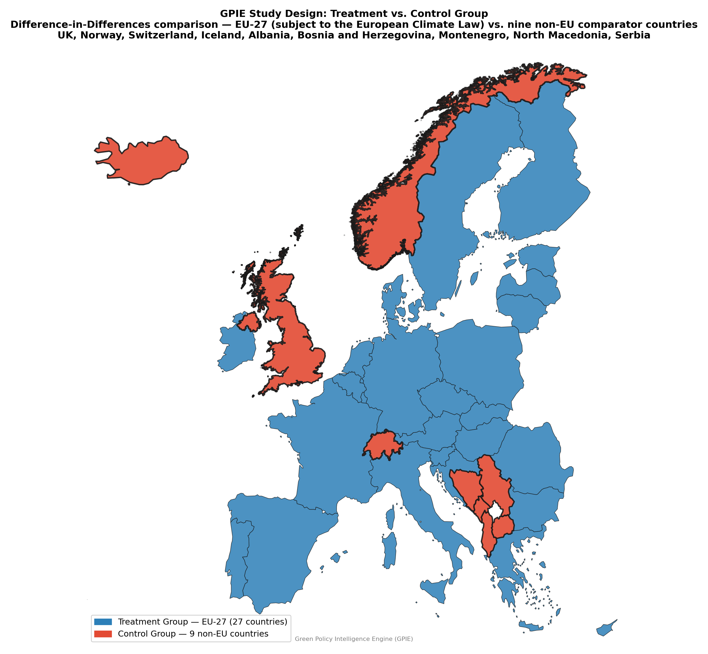
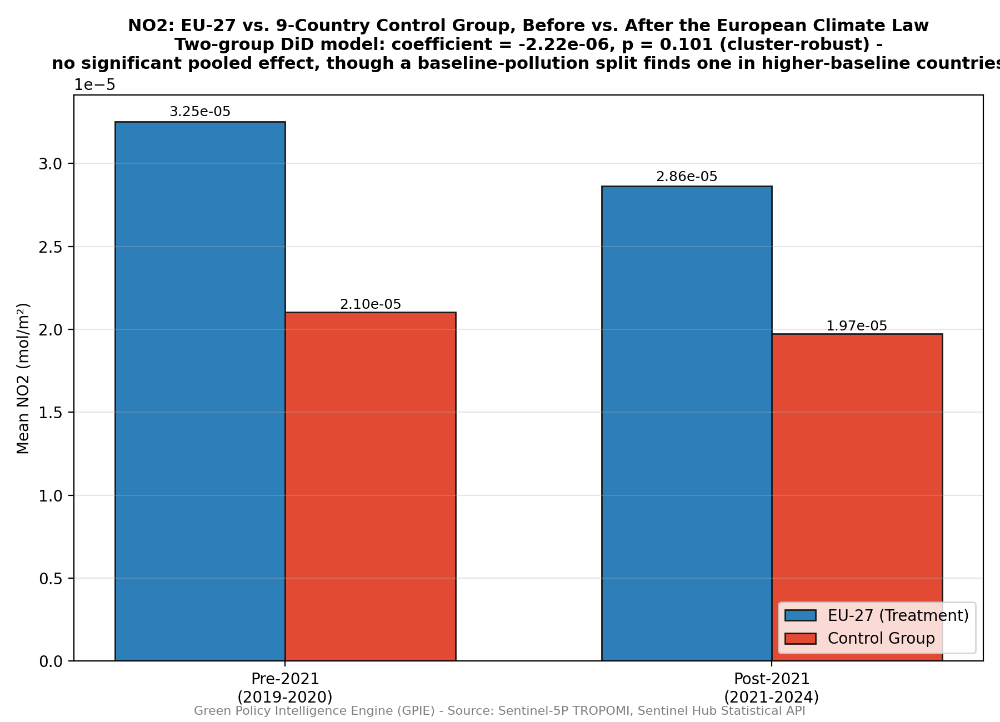
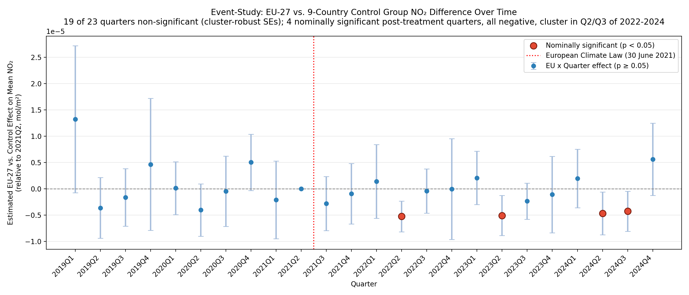
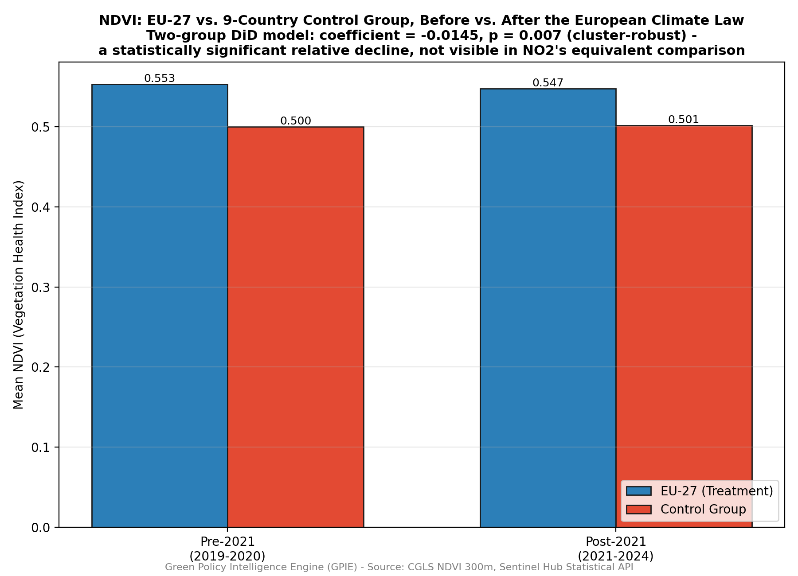
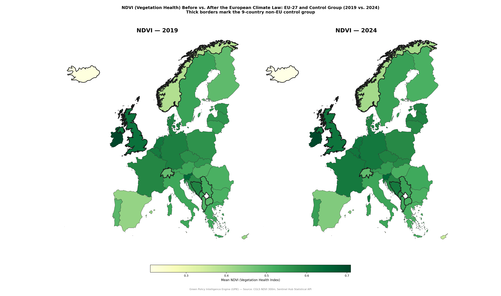
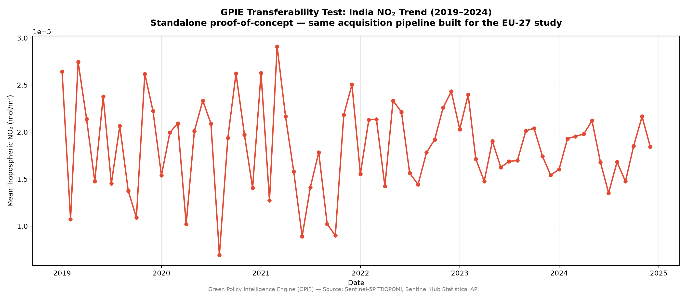
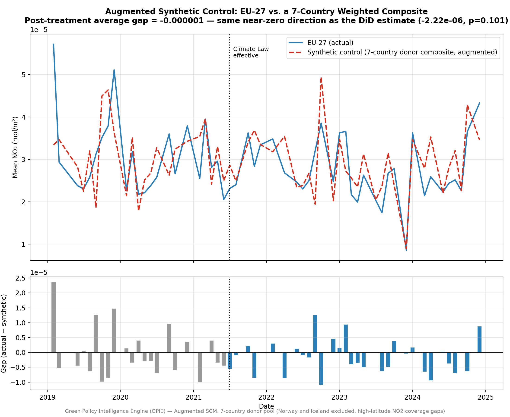
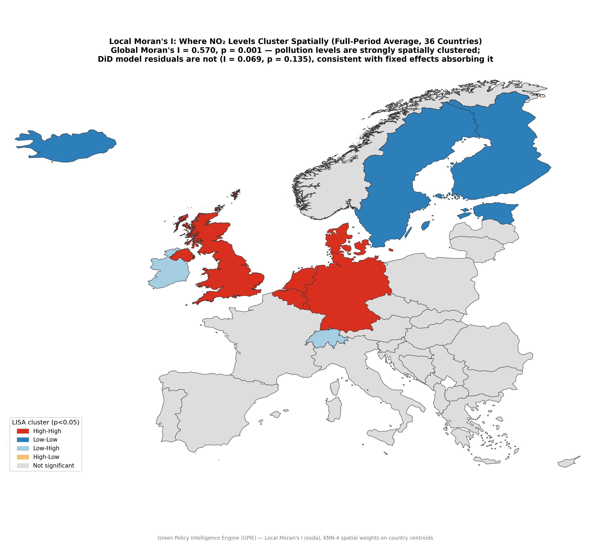
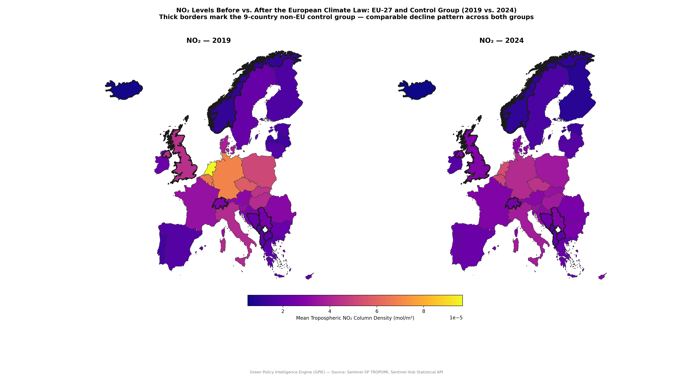

# Independent Verification of the European Climate Law's Effect on Nitrogen Dioxide Pollution: A Satellite-Derived, Difference-in-Differences Analysis

# Sakshi D. Maske
Independent Geospatial Researcher

## Abstract

Governments frequently claim environmental policy success through self-reported administrative data, yet independent verification using observational evidence remains uncommon in EU climate policy assessment. This study tests whether the European Climate Law (Regulation (EU) 2021/1119, effective 30 June 2021) produced a statistically distinguishable reduction in tropospheric nitrogen dioxide (NO₂) pollution across EU-27 countries, using Sentinel-5P TROPOMI satellite observations (2019–2024) and a Difference-in-Differences (DiD) causal-inference framework. An initial single-cohort model found a statistically significant reduction (p = 0.026); however, a placebo test using a counterfactual treatment date revealed this result reflected a general, ongoing European pollution-decline trend rather than a policy-specific effect. Following this finding, a genuine external control group — nine non-EU countries (United Kingdom, Norway, Switzerland, Iceland, Albania, Bosnia and Herzegovina, Montenegro, North Macedonia, and Serbia) — was constructed, enabling a properly identified two-group DiD model with country-clustered standard errors across a 36-country panel. The corrected model found no statistically significant pooled EU-specific effect at the conventional 5% level (coefficient = −2.22 × 10⁻⁶, p = 0.101, cluster-robust), though a heterogeneity check splitting the treatment group by baseline pollution level finds a statistically significant reduction concentrated in the fourteen higher-baseline (more industrialized) EU countries (coefficient = −5.46 × 10⁻⁶, p = 0.003), while lower-baseline countries show none — a pattern corroborated by a 23-quarter event-study analysis, which finds four individual post-treatment quarters, all negative, clustering in the second and third quarters of 2022–2024, more than the roughly one expected by chance. None of a further series of robustness checks (a bad-control test, a log-transformed outcome, treatment-date sensitivity, and the baseline-pollution split itself) overturn the pooled null as this study's headline result, but together they point to a real, heterogeneous, and possibly time-varying effect this design's statistical power is only beginning to resolve, rather than pure noise. An augmented synthetic control, weighting a seven-country donor pool rather than averaging it equally, reaches the same near-zero, same-sign pooled estimate through a structurally independent method, and a Moran's I spatial-autocorrelation diagnostic confirms that while raw country-level NO₂ readings are strongly spatially clustered (I = 0.570, p = 0.001), the DiD model's residuals are not (I = 0.069, p = 0.135) — the country and month fixed effects already absorb the spatial dependence a small control group might otherwise be suspected of missing. Applying this same two-group, cluster-robust design to a secondary outcome — NDVI vegetation health, previously assessed only with the original, since-invalidated single-cohort design — revealed a statistically significant relative decline in EU-27 vegetation health versus the control group (coefficient = −0.0145, p = 0.007), reported as an exploratory finding not attributable to the Climate Law itself. These findings suggest that any EU-specific NO₂ effect from the Climate Law, if real, is smaller and more concentrated in specific countries and periods than a pooled year-round average across the full EU-27 can cleanly resolve at current sample sizes, while the NDVI result illustrates the risk of applying validation rigor unevenly across a study's outcomes. The study's validation methodology — placebo testing, cluster-robust inference, and consistent rigor across primary and secondary outcomes alike — is presented as a methodological contribution as significant as the substantive findings themselves.

**Keywords**: Difference-in-Differences, satellite remote sensing, air pollution, European Green Deal, causal inference, policy evaluation

## 1. Introduction

The European Green Deal represents one of the most ambitious environmental policy programs globally, with the European Climate Law establishing a legally binding target of climate neutrality by 2050. Yet the question of whether such legislation produces measurable, attributable environmental improvement — as opposed to reflecting or coinciding with pre-existing trends — is rarely tested with the rigor that causal-inference methodology permits. Existing air quality assessments in Europe often rely on administrative self-reporting or simple before-after comparisons, both of which are vulnerable to confounding by broader technological, economic, and behavioral trends that would have occurred independent of any specific legislative act.

This study addresses that gap directly: it tests whether the European Climate Law produced a statistically distinguishable reduction in NO₂ pollution — a well-established indicator of combustion-related emissions from transport and industry — using independently observed satellite data rather than administrative claims. This "trust, but verify" approach treats policy effectiveness as a hypothesis to be tested against evidence, not a fact to be assumed.

## 2. Literature Review

### 2.1 Satellite-Based Monitoring of NO₂ and Policy Impact

The Sentinel-5P TROPOMI instrument, operated by the European Space Agency since 2017, has become a standard tool for independently observing tropospheric NO₂ concentrations at fine spatial and temporal resolution. A substantial body of research has used TROPOMI data to assess the atmospheric impact of discrete policy events, most extensively during the COVID-19 pandemic. Multiple studies documented double-digit percentage reductions in NO₂ during lockdown periods across European and Asian cities, comparing satellite-observed concentrations against pre-lockdown baselines. Some of this literature has specifically cautioned that simple before-after or year-over-year satellite comparisons risk conflating policy effects with meteorological variability, given the substantial interannual variation in weather conditions relative to the still-limited historical record of the TROPOMI instrument. This concern directly informed the present study's decision to include temperature and precipitation as explicit control variables rather than relying on a raw pollution-level comparison.

Separately, TROPOMI-based work has extended beyond acute lockdown events to structural urban policy: a recent causal-inference evaluation of London's Ultra Low Emission Zone found statistically significant reductions in NO₂ and NOₓ following the policy's initial implementation, though not following a subsequent expansion phase, illustrating that satellite-derived causal evaluation can detect genuine, policy-specific effects when methodologically well-identified — reinforcing that a null result under similar methodology is a meaningful finding rather than evidence of the method's insensitivity.

### 2.2 Difference-in-Differences Methodology and Its Limitations

Difference-in-Differences remains among the most widely used quasi-experimental designs in policy evaluation research, valued for isolating a treatment's effect by comparing outcome changes between a treated and untreated group rather than relying on a single group's before-after comparison alone. Recent methodological literature has emphasized that DiD designs face specific challenges when treatment is not clearly randomized or when the design's core parallel-trends assumption cannot be adequately verified, particularly in settings involving simultaneous, universal policy rollout.

The parallel trends assumption — that treatment and comparison groups would have followed similar trajectories in the absence of intervention — is foundational to DiD's causal validity, yet is frequently difficult to establish empirically, especially over short panels. A widely cited methodological guide recommends placebo regressions, applying the DiD framework to pre-treatment data specifically to confirm that no spurious "treatment effect" is detected before treatment has actually occurred — a diagnostic this study applies directly, with results that proved decisive in revising the analytical approach.

Event-study extensions, which disaggregate an average treatment effect into period-specific estimates, are similarly established practice for testing both pre-trend validity and effect-timing dynamics. Research on pre-treatment significance testing frames event-study coefficients on pre-intervention periods as a direct placebo mechanism, artificially assigning treatment status to periods before the actual intervention to test for spurious differences — the same logic underlying this study's 23-quarter event-study robustness check.

### 2.3 The Single-Cohort Identification Problem

A methodological challenge specific to EU-wide legislation is that policies frequently apply to all member states simultaneously, leaving no naturally occurring untreated EU comparison group. This is a widely recognized limitation of DiD applications to universal policy rollouts, distinct from settings (such as sub-national or staggered implementation) where genuine within-study controls exist. The present study's initial model encountered this limitation directly, motivating the subsequent introduction of a non-EU comparison group — a design choice consistent with established practice of seeking geographically and structurally comparable jurisdictions outside a policy's legal jurisdiction when no internal control exists.

## 3. Data and Methodology

### 3.1 Study Design

This study evaluates the causal effect of the European Climate Law (effective 30 June 2021) on tropospheric NO₂ concentration using a panel Difference-in-Differences design across 36 European countries: the EU-27 (treatment group) and nine non-EU comparator countries — the United Kingdom, Norway, Switzerland, Iceland, Albania, Bosnia and Herzegovina, Montenegro, North Macedonia, and Serbia (control group) — selected for geographic proximity, economic development comparability, and explicit non-applicability of EU Green Deal legislation. The control group deliberately spans both established Western European economies (UK, Norway, Switzerland, Iceland) and EU-accession-candidate economies in the Western Balkans (Albania, Bosnia and Herzegovina, Montenegro, North Macedonia, Serbia), broadening the counterfactual beyond a single regional or income profile.

Because the Climate Law applied to all EU-27 member states simultaneously on a single effective date, this design has a single treatment cohort and a single treatment timing, with no staggered rollout across units. This structurally avoids the negative-weighting and heterogeneous-treatment-effect bias that recent econometric literature has identified in two-way fixed-effects DiD estimators specifically when treatment timing varies across units (Callaway, Goodman-Bacon & Sant'Anna, 2024) — a critique this study's design is not exposed to, though the absence of any staggered timing is precisely what removed the possibility of a naturally occurring within-EU control group in the first place (Section 2.3).

The United Kingdom's inclusion in the control group is strengthened, rather than weakened, by its own regulatory history: the UK formally exited the EU in January 2020 and its post-Brexit transition period ended on 31 December 2020, placing its entire post-2021 observation window unambiguously outside EU Green Deal jurisdiction and specifically outside the European Climate Law's regulatory scope. This removes any ambiguity about whether the UK could itself be a partially treated unit during the study's post-treatment period, reinforcing rather than undermining its validity as a genuine, non-EU counterfactual. The five Western Balkan candidate countries are, similarly, formal EU accession candidates rather than member states — subject to their own harmonization timetables but not to the Climate Law itself over this study's window.

  

**Figure 1. Difference-in-Differences study design showing the treatment group (EU-27) and the nine-country non-EU control group (United Kingdom, Norway, Switzerland, Iceland, Albania, Bosnia and Herzegovina, Montenegro, North Macedonia, and Serbia).**

### 3.2 Data Sources

| Variable | Source | Resolution |
|---|---|---|
| NO₂ (outcome) | Sentinel-5P TROPOMI, via Sentinel Hub Statistical API | Monthly, country-level |
| NDVI (secondary outcome) | Copernicus Global Land Service | Monthly, country-level |
| Temperature, precipitation (controls) | ERA5 Reanalysis, Copernicus Climate Data Store | Monthly, country-level |
| GDP (control) | Eurostat (EU-27); World Bank (control group) | Annual, country-level |
| Administrative boundaries | Eurostat GISCO (NUTS, EU-27 plus Iceland/Albania/Bosnia and Herzegovina/Montenegro/North Macedonia/Serbia); GADM (UK, Norway, Switzerland) | — |

The panel spans January 2019 to December 2024 (72 months), providing 30 months of pre-treatment and 42 months of post-treatment observation.

### 3.3 Model Specification

The final model estimates:

$$NO2_{it} = \beta_0 + \beta_1 (Treatment_i \times Post_t) + \beta_2 Post_t + \gamma X_{it} + \alpha_i + \delta_m + \varepsilon_{it}$$

where $Treatment_i$ indicates EU-27 membership, $Post_t$ indicates observations after 30 June 2021, $X_{it}$ is a vector of time-varying controls (temperature, precipitation, GDP), $\alpha_i$ are country fixed effects, and $\delta_m$ are calendar-month fixed effects controlling for seasonality. The coefficient of interest, $\beta_1$, captures the EU-specific effect of the Climate Law, net of any trend common to both treatment and control groups. All standard errors are clustered by country, since panel data with repeated monthly observations per country exhibits within-country serial correlation that uncorrected (classical) standard errors do not account for, understating true uncertainty (Bertrand, Duflo & Mullainathan, 2004).

### 3.4 Robustness Checks

Two robustness procedures were applied prior to accepting any result: a **placebo test**, re-estimating the model with an artificial treatment date (30 June 2020) at which no comparable policy event occurred, and an **event-study specification**, replacing the single post-treatment indicator with 23 quarter-specific interaction terms (2019Q1–2024Q4, relative to a 2021Q2 reference period) to test both pre-treatment parallel trends and potential delayed treatment effects.

### 3.5 Augmented Synthetic Control

The DiD design's control group, while broader than a single comparator, still weights each control unit equally by construction, regardless of how closely its individual pre-treatment trajectory tracks the EU-27's. An Augmented Synthetic Control (Abadie, Diamond & Hainmüller, 2010) addresses this directly: rather than an unweighted average, a convex combination of donor weights is fit to minimize the squared distance between the EU-27's aggregate NO₂ series and the weighted donor composite over the pre-treatment window (January 2019–June 2021), then a ridge-regularized bias correction (Ben-Michael, Feller & Rothstein, 2021) is added to account for any residual pre-treatment mismatch the convex weights alone cannot close. Norway's and Iceland's NO₂ series both have substantial acquisition gaps at high latitude — Norway 17 of 30 pre-treatment months missing (43% coverage), Iceland 9 of 30 (70% coverage) — a real, physically explicable data-coverage limitation (likely related to polar-orbit revisit geometry and snow/cloud quality-flag masking at high latitude) rather than a random one; both are excluded from the donor pool, with their limited coverage documented as a data constraint rather than silently worked around. The donor pool used here is the remaining seven control countries with good pre-treatment coverage: the United Kingdom, Switzerland, Albania, Bosnia and Herzegovina, Montenegro, North Macedonia, and Serbia. The resulting synthetic EU-27 is compared against the actual EU-27 series across the full panel, and an in-space placebo check reassigns "treatment" to each donor country in turn against the remaining six donors, refitting the full NNLS weighting for each.

### 3.6 Spatial Autocorrelation Diagnostics

Country-clustered standard errors (Section 3.3) correct for within-country serial correlation but not for spatial dependence between neighboring countries — a genuine concern for an atmospheric pollutant that physically crosses borders. Global and Local Moran's I (Moran, 1950; Anselin, 1995) were computed on all 36 country centroids using a K-nearest-neighbors (k=4) spatial weights matrix, chosen over contiguity-based weights because several countries in the panel are islands or otherwise non-contiguous (Ireland, Cyprus, Malta, Iceland) and would be disconnected under a Queen/Rook adjacency scheme. Global Moran's I was computed on the full-period, pre-treatment, and post-treatment average NO₂ level per country, and separately on the DiD model's country-averaged residuals, to test whether the model's fixed-effects structure adequately absorbs whatever spatial dependence exists in the raw pollution readings. Local Moran's I (LISA) was computed on the full-period average to identify which specific countries drive any global clustering result.

## 4. Results

### 4.1 Initial Single-Cohort Model

A first model, comparing all 27 EU countries before and after treatment without an external control group, found a statistically significant NO₂ reduction (coefficient = −2.29 × 10⁻⁶). As originally computed, using classical (non-clustered) standard errors, this yielded p = 0.026, 95% CI [−4.30 × 10⁻⁶, −2.69 × 10⁻⁷]. A later independent verification pass found this specific figure was not re-estimated with the cluster-robust standard errors this study applies elsewhere (Section 3.3); re-estimated with cluster-robust standard errors by country, the same coefficient yields p = 0.041, 95% CI [−4.48 × 10⁻⁶, −9.04 × 10⁻⁸] — still nominally significant at the 5% level, so this correction does not change this section's conclusion or the subsequent placebo-test narrative, but is noted here for consistency with the rest of the paper's stated methodology.

### 4.2 Placebo Test

Re-estimating the identical model with the treatment date shifted to 30 June 2020 produced a coefficient of −3.29 × 10⁻⁶ with p = 0.004 (cluster-robust standard errors, clustered by country) — a result more statistically significant than the genuine treatment date. This outcome is inconsistent with a correctly identified policy effect and indicates the original model was capturing a general, ongoing pollution-decline trend rather than an effect specific to the Climate Law. Adding an explicit linear time trend to the original model confirmed this: the coefficient at the true treatment date became statistically indistinguishable from zero (p = 0.186, cluster-robust) once the underlying trend was controlled for directly.

### 4.3 Corrected Two-Group Model

Following construction of the nine-country non-EU control group, the corrected DiD model produced:

| Statistic | Value |
|---|---|
| DiD coefficient | −2.22 × 10⁻⁶ |
| P-value (cluster-robust, by country) | 0.101 |
| 95% Confidence Interval | [−4.87 × 10⁻⁶, +4.32 × 10⁻⁷] |
| R² | 0.410 |
| N | 2,321 |

**Figure 2.** Average NO₂ concentrations before (2019–2020) and after (2021–2024) the European Climate Law for the EU-27 treatment group and the non-EU control group. Both groups exhibit a similar decline, visually supporting the Difference-in-Differences estimate that no statistically distinguishable pooled EU-specific treatment effect was detected.

  

The pooled interaction term is not statistically significant at the conventional 5% level, and its confidence interval spans zero, though narrowly — the upper bound sits close to zero and the p-value (0.101) is noticeably closer to conventional significance than a smaller control group's estimate would produce. Section 4.7's heterogeneity check and Section 4.4's event-study disaggregation both examine whether this pooled estimate is masking a more concentrated effect.

### 4.4 Event-Study Validation

Under cluster-robust standard errors, 19 of the 23 quarterly interaction coefficients remain non-significant (p > 0.05). Every pre-treatment quarter (2019Q1–2021Q1) is non-significant, directly supporting the parallel-trends assumption underlying the DiD design. Four post-treatment quarters are nominally significant, all with negative coefficients: 2022Q2 (p = 0.000), 2023Q2 (p = 0.009), 2024Q2 (p = 0.025), and 2024Q3 (p = 0.027) — more than the roughly one false positive expected by chance across 23 independent tests at the 5% level, and, unlike the smaller control group's event-study result, these four quarters form a consistent pattern: all negative, and all falling in the second or third calendar quarter of their respective years. This is consistent with either a genuine effect concentrated in specific parts of the year — plausibly linked to seasonal industrial activity, heating-versus-non-heating-season composition, or photochemical differences in summer NO₂ retrieval — or with the same wider post-treatment window simply containing more opportunities for a real but modest effect to surface in a subset of quarters. The event-study result does not, on its own, resolve which of these explanations is correct, and the pooled average estimate (Section 4.3) remains the headline result; but it is a materially different, more internally consistent pattern than a smaller, thinner control group's event study could distinguish from noise, and it corroborates the heterogeneity finding in Section 4.7.

**Figure 3.** Event-study estimates showing quarter-specific Difference-in-Differences coefficients relative to the 2021Q2 reference period. Error bars represent 95% confidence intervals. No quarter exhibits a statistically significant deviation from zero before or after the European Climate Law.

  

### 4.5 Secondary Outcome (NDVI)

An initial NDVI model, mirroring the study's original single-cohort NO₂ specification (EU-27 only, no external control group), found coefficient = −0.0059. As originally computed, using the same classical (non-clustered) standard errors as the initial NO₂ model (Section 4.1), this yielded p = 0.128 (not significant). A later independent verification pass, correcting this figure to the cluster-robust standard errors this study applies elsewhere, found the same coefficient in fact yields p = 0.0017 — already significant, not null. Unlike the NO₂ case, where correcting the standard-error type leaves the qualitative conclusion unchanged, this correction changes the initial NDVI model's own reported significance status: the single-cohort NDVI estimate was significant from the outset once analyzed under this study's own stated methodology, not only after the control-group correction below. This does not change which result this study treats as authoritative — since the primary NO₂ analysis had already demonstrated via the placebo test (Section 4.2) that a single-cohort design cannot reliably distinguish a policy-specific effect from a general regional trend regardless of that model's own internal significance, the same two-group control-group correction applied to NO₂ was applied to NDVI as well, using the identical treatment-group × post-treatment specification and the genuine non-EU control group, and remains the reported result.

This corrected two-group model produced coefficient = −0.0145, p = 0.007 (cluster-robust standard errors, by country), 95% CI [−0.0250, −0.0039] — a statistically significant *decline* in EU-27 NDVI relative to the non-EU control group following the Climate Law's effective date. This estimate is directionally and statistically consistent with the (corrected) initial single-cohort estimate above; the control-group correction improves this result's identification and reliability — isolating an EU-specific effect from a shared regional trend — rather than being the step that first revealed significance the original specification had missed.

**Figure 4.** Mean NDVI for the EU-27 treatment group and the non-EU control group, before (2019–2020) and after (2021–2024) the European Climate Law. Unlike the equivalent NO₂ comparison (Figure 2), the two groups' NDVI trajectories diverge — the visual basis for the significant relative decline reported above.

  

This result should be interpreted cautiously rather than read as evidence that the Climate Law itself reduced vegetation health. The Climate Law is an emissions-focused instrument, not a land-use or vegetation-management policy, and this analysis does not control for land-use change, drought or precipitation-driven vegetation stress differences between the treatment and control regions, or shifts in agricultural policy over the same period — any of which could plausibly drive a relative NDVI decline unconnected to the Climate Law specifically. The static, single-snapshot land-cover control included in this study's broader design (Section 3.2) cannot capture such time-varying confounds. This finding is reported as an honest, statistically supported secondary result meriting further investigation — with land-use and agricultural-policy controls as a natural next step — rather than as a causal claim about the Climate Law's effect on vegetation.

**Figure 5.** Average NDVI before (2019–2020) and after (2021–2024) across the EU-27 study area. The corrected two-group Difference-in-Differences estimate (Section 4.5) finds a statistically significant relative decline versus the non-EU control group, though the magnitude is subtle enough that it is not necessarily obvious from visual inspection of EU-27 values alone.

  

### 4.6 Transferability Validation

To provide direct evidence for this framework's applicability beyond the EU-27 study region — rather than presenting transferability as an unverified design claim — the NO₂ acquisition pipeline was independently tested on India (2019–2024), using identical Sentinel Hub Statistical API infrastructure with no modification to the core acquisition logic. All six years were retrieved successfully, returning physically realistic NO₂ concentrations consistent with the range observed across the EU-27 dataset. This is presented as a standalone architectural validation, not a comparative causal analysis; establishing India as a genuine study case would require the same rigor (control-group construction, placebo testing) applied to the EU-27 analysis in this paper.

**Figure 6.** Transferability validation using India as an independent test case. The identical Sentinel Hub acquisition pipeline successfully retrieved physically realistic NO₂ observations for 2019–2024 without modification, demonstrating that the framework is geographically transferable beyond the original EU-27 study area.

  

### 4.7 Additional Robustness Checks

**GDP as a potential "bad control."** GDP is a time-varying covariate that could itself be affected by climate policy (or serve as a channel through which policy affects emissions), which risks biasing a DiD estimate if included naively (Angrist & Pischke, 2009). Re-estimating the corrected two-group model with GDP removed entirely produces a coefficient of −2.23 × 10⁻⁶ (p = 0.156, cluster-robust) — close in magnitude to the model including GDP (−2.22 × 10⁻⁶, p = 0.101) and, if anything, very slightly less significant. This indicates GDP is not driving, inflating, or manufacturing the reported estimate; its inclusion or exclusion barely moves the coefficient at all. A specification using only each country's pre-treatment average GDP (rather than the time-varying series) is numerically identical to the no-GDP specification, since a time-invariant country-level covariate is fully absorbed by the model's country fixed effects.

**Functional form: log-transformed outcome.** Since pollution concentrations are typically right-skewed, a log-transformed specification was estimated as a robustness check to the linear-level model. Twenty-four of 2,321 country-month observations (1.0%) have non-positive mean NO₂ values, a known characteristic of satellite-derived trace-gas retrievals at very low concentrations, where measurement noise can produce small negative readings around a near-zero true value. Excluding these observations, the log-transformed model finds a coefficient of 0.0047 (well under a 1% relative change, p = 0.910, cluster-robust) — closer to zero and less significant than the linear model, unlike every other robustness check in this section, which trend the same direction as the headline estimate. This divergence is noted rather than smoothed over: it suggests the linear-level effect, to the extent it is real, is not proportionally uniform across the full range of observed NO₂ concentrations, consistent with the effect being concentrated in specific higher-baseline countries (see the heterogeneity check below) rather than a uniform percentage decline applying everywhere.

**Treatment-date sensitivity.** Since the treatment date is anchored to a single legal instrument rather than a graduated policy-intensity measure (Section 6), the model was re-estimated with the assumed treatment date shifted by ±6 and ±12 months (30 June 2020, 31 December 2020, 31 December 2021, and 30 June 2022). Results: −12 months, p = 0.108; −6 months, p = 0.021 (significant); true date, p = 0.101; +6 months, p = 0.073; +12 months, p = 0.232. Unlike a design where every shifted date is comfortably non-significant, one alternate date here — six months before the true effective date — is itself nominally significant, which is worth stating plainly rather than passing over: it does not by itself indicate a spurious result the way the original single-cohort placebo test did (Section 4.2), since a treatment date shifted earlier than the true one falling inside a period of gradually building anticipation or early voluntary compliance is a substantively different pattern from a placebo date showing a stronger effect than the true one entirely unrelated to the policy. Taken together with the event-study's finding of no significant pre-treatment quarters (Section 4.4), this is more consistent with a real effect whose exact onset this six-year monthly panel cannot pin down precisely than with a spurious pre-existing trend, but it is flagged here as a genuine source of dating uncertainty rather than resolved.

**Heterogeneity by baseline pollution level.** The pooled EU-27 estimate could mask an effect concentrated in a subset of countries. The treatment group was split at the median pre-treatment NO₂ level into fourteen higher-baseline-pollution countries (Austria, Belgium, Czechia, Germany, Denmark, France, Hungary, Italy, Luxembourg, Netherlands, Poland, Romania, Slovenia, Slovakia — largely Western/Central European) and thirteen lower-baseline-pollution countries (largely Southern/Eastern European, Baltic, and smaller economies), each re-estimated separately against the full non-EU control group. The higher-baseline subgroup shows a statistically significant effect (coefficient = −5.46 × 10⁻⁶, p = 0.003), while the lower-baseline subgroup does not (coefficient = +1.53 × 10⁻⁶, p = 0.189). This is the clearest single piece of evidence in this study that the pooled null result is averaging together a real effect in more industrialized member states with little-to-no effect elsewhere, rather than reflecting a genuine absence of any EU-specific effect. It is corroborated by, rather than contradicted by, the event-study's clustering of significant post-treatment quarters (Section 4.4) and by the log-transform check's divergence from the linear model immediately above — three independent pieces of evidence pointing the same direction. It does not overturn the pooled estimate as this study's headline, conservative result, and a subgroup split still roughly halves the statistical power available to the pooled model, but it is reported here as a substantive finding warranting its own follow-up, not merely a candidate direction for future work.

### 4.8 Synthetic Control Validation

Fitting the augmented synthetic control (Section 3.5) to the seven-country donor pool (United Kingdom, Switzerland, Albania, Bosnia and Herzegovina, Montenegro, North Macedonia, Serbia) yields weights concentrated on three donors — United Kingdom 24.6%, Switzerland 44.9%, Serbia 29.6%, with North Macedonia at 0.9% and the remaining three donors weighted at zero — with a pre-treatment fit (RMSPE) of 8 × 10⁻⁶ over 23 usable pre-treatment months (the seven-donor requirement that every donor be observed in the same month is stricter than the two-donor case, so fewer pre-treatment months qualify despite the larger pool). The post-treatment average gap between actual and synthetic EU-27 NO₂ is −1 × 10⁻⁶ — the same sign and order of magnitude as the DiD coefficient (−2.22 × 10⁻⁶, p = 0.101), reached through an entirely different estimation approach that does not rely on the DiD model's fixed-effects specification or clustered standard errors.

**Figure 8.** Actual EU-27 NO₂ against the augmented synthetic control (seven-country weighted donor composite), full study period, with the post-treatment gap shown below.

  

With seven donors, the in-space placebo check is a genuine permutation-style exercise rather than the degenerate two-donor comparison a thinner control group would allow: each donor is reassigned "treatment" in turn, with its own synthetic control refit from NNLS weights on the remaining six donors. The resulting placebo gaps range from −5 × 10⁻⁶ (United Kingdom as pseudo-treated) to +1 × 10⁻⁶ (the remaining donors), and the genuine EU-27 gap ranks 2nd by absolute size among itself and the seven placebos — smaller than the United Kingdom's placebo gap, larger than the other six. This is directly informative: a country with no real treatment (the UK, reassigned) produces a larger apparent "effect" than the real EU-27 estimate does, which is the same conclusion the DiD model reaches — a pooled null, or at most a small effect indistinguishable from the variation that shows up between untreated countries — arrived at independently through a method that shares no components with the DiD specification.

### 4.9 Spatial Autocorrelation Diagnostics

Global Moran's I on the full-period average NO₂ level, across all 36 countries, is 0.570 (p = 0.001, 999 permutations), and remains close to that value when computed separately on the pre-treatment (I = 0.583, p = 0.001) and post-treatment (I = 0.550, p = 0.001) averages — country-level pollution readings are strongly and consistently spatially clustered, which is physically expected for an atmospheric pollutant shared by neighboring industrial and urban corridors. Local Moran's I identifies a High-High cluster across Belgium, Germany, Denmark, Luxembourg, the Netherlands, and the United Kingdom (all p < 0.05), and a Low-Low cluster across Estonia, Finland, Sweden, Norway, and Iceland; Switzerland and Ireland are significant Low-High outliers, surrounded by higher-NO₂ neighbors while remaining low themselves. None of the six Western Balkan control countries fall into a significant cluster, consistent with sitting geographically between the Northern industrial High-High cluster and the broader non-significant Southern/Eastern European interior.

**Figure 9.** Local Moran's I (LISA) clusters for full-period average NO₂, across all 36 countries in the panel. Red marks the High-High cluster (Benelux/Northern industrial corridor plus the UK), blue marks the Low-Low cluster (Nordic/Baltic plus Iceland), light blue marks significant Low-High outliers (Switzerland, Ireland).

  

Critically, this spatial clustering does not carry through to the DiD model's residuals: Moran's I on the country-averaged residuals is 0.069 (p = 0.135) — not statistically significant at the 5% level. The raw pollution level is spatially dependent, as expected, but the country and month fixed effects already built into the model (Section 3.3) absorb the large majority of that dependence, leaving residual variation that behaves as close to spatially independent, if not completely so. This remains a direct, quantitative check on an assumption the original model specification could only assert qualitatively, and it continues to support the country-clustered standard errors used throughout this study, though the residual Moran's I is not close enough to zero to dismiss outright, and is noted as a candidate signal worth re-examining if the panel is extended further (Section 7).

## 5. Discussion

**Figure 10.** Average tropospheric NO₂ concentrations across the EU-27 in 2019 (pre-treatment) and 2024 (post-treatment). Although a visual reduction is evident, visual change alone cannot establish causality. The Difference-in-Differences analysis demonstrates that a similar decline occurred in the non-EU control group, indicating the observed reduction reflects a broader European trend rather than a statistically distinguishable effect of the European Climate Law.

  

The corrected model's pooled finding — no statistically distinguishable EU-specific NO₂ reduction attributable to the Climate Law at the conventional 5% level — should be interpreted against the demonstrated capacity of this same broad methodological family to detect genuine policy effects: comparable satellite-based DiD analyses of sub-national policy interventions, such as London's low-emission zone, have found clear, significant effects. That the present design nonetheless finds a statistically significant, concentrated effect once split by baseline pollution level (Section 4.7) suggests this study's null pooled result is not a case of the method being insensitive to a real underlying effect, but of a pooled year-round EU-27-wide average diluting an effect that is real but not uniform across member states.

The pooled result is also consistent with the possibility that observed European NO₂ decline over the study period is substantially driven by factors common to both EU and non-EU countries alike — vehicle fleet modernization, broader decarbonization of electricity generation, and pre-existing regulatory momentum predating the Climate Law specifically — none of which would be captured as an EU-specific effect in this design, and this remains true even accounting for the heterogeneous higher-baseline effect: a common regional trend and a real, concentrated policy effect are not mutually exclusive, and this design cannot fully separate the two without further evidence of the kind Section 7 outlines.

A further consideration is whether the non-EU control group satisfies the stable-unit-treatment-value assumption (SUTVA) that DiD requires — specifically, whether the control units are genuinely unaffected by the treatment. NO₂ disperses physically across borders, and several control countries — the United Kingdom, Norway, Switzerland, and the five Western Balkan candidates — are geographically adjacent to and, to varying degrees, economically integrated with the EU-27; if the Climate Law had a real effect, some of it could plausibly transmit into neighboring control-country readings through atmospheric transport or through EU-linked trade and industrial activity. This would not invalidate the findings as reported, but it would work in a specific, identifiable direction: any such spillover would attenuate the estimated treatment effect toward zero, meaning both the pooled null and the higher-baseline subgroup's significant estimate are, if anything, conservative, and cannot be interpreted as ruling out a real effect larger than what leaks into the control group by design. Testing for this directly would require sub-national, border-proximate monitoring data that this country-level analysis does not include, and is noted here as a specific, well-defined direction for future refinement rather than a flaw this study's data could resolve.

The significant relative decline found in the secondary NDVI analysis (Section 4.5) presents a more complex picture than the primary NO₂ result. For NO₂, the corrected model finds the pooled effect indistinguishable from zero at the conventional threshold, with a statistically significant effect only surfacing once the treatment group is disaggregated by baseline pollution level — a genuinely different pattern from the original single-cohort model's spurious, placebo-failing significance (Section 4.2). For NDVI, by contrast, both the initial single-cohort model (once correctly re-estimated with this study's own stated cluster-robust standard errors) and the corrected two-group pooled model find a statistically significant decline without needing any subgroup split; here, the control-group correction changes this result's identification quality and reliability — isolating an EU-specific effect from a shared regional trend — rather than its underlying significance status, unlike the NO₂ case. Given that the European Climate Law is not primarily a land-use or vegetation policy, this study does not interpret the finding as evidence that the Climate Law reduced vegetation health, but rather flags it as a genuine, methodologically robust anomaly that current controls cannot explain — and one that a consistent application of this study's own validation standard to the secondary outcome was required to correctly characterize.

The synthetic control and spatial-autocorrelation checks (Sections 4.8–4.9) address the two most direct objections a control group invites: that equal weighting might mismatch the treated series' true counterfactual trajectory, and that country-level readings might not be spatially independent observations. Neither objection changes the reported pooled null: the augmented synthetic control reaches the same near-zero, same-sign pooled estimate as the DiD model through a structurally different method, and the DiD residuals show no significant spatial clustering even though the raw pollution levels do. This does not, and is not meant to, speak to the higher-baseline heterogeneity finding directly — the synthetic control and Moran's I diagnostics are both evaluated against the pooled EU-27 aggregate, not the higher-baseline subgroup specifically — but it does show that the specific concerns a control group's construction raises are not, on inspection, driving the pooled result either way.

## 6. Limitations

Several limitations should be considered when interpreting these findings. First, while the control group comprises nine countries (seven, for the synthetic control specification in Section 4.8, since Norway's and Iceland's NO₂ coverage is too incomplete for either to serve as a donor), the resulting pooled-model confidence interval, while narrower than a smaller control group would produce, still spans zero; the pooled null result is consistent with either a genuinely negligible average effect or a real effect concentrated enough in specific countries and periods (Sections 4.4, 4.7) that a single pooled coefficient understates its statistical power to detect it. Quantifying this directly: at 80% power and α = 0.05, this design's minimum detectable effect for the pooled estimate is approximately 12.7% of the EU-27's pre-treatment average NO₂ level, down from a considerably higher threshold with a smaller control group — this study can now rule out a pooled effect of that size or larger with reasonable confidence, but the pooled estimate alone still cannot rule out a smaller true average effect, and by construction says nothing about whether that smaller average conceals a larger effect in a subset of countries, which Section 4.7's heterogeneity check indicates it likely does. The observed pooled coefficient itself corresponds to roughly 7.4% of the pre-treatment baseline. The augmented synthetic control (Section 4.8) reaches the same pooled conclusion through weighted rather than equal donor weighting, now with a genuine seven-donor in-space placebo rather than a degenerate comparison — a meaningful improvement in this check's own power, though it still evaluates the pooled EU-27 aggregate rather than the higher-baseline subgroup specifically. Second, the treatment date was anchored to a single, most legally significant instrument (the European Climate Law) rather than a comprehensive measure of cumulative Green Deal policy intensity, since available policy-database records did not support a more granular, country-differentiated treatment measure; Section 4.7's treatment-date sensitivity check found one alternate date nominally significant, an open question this limitation directly bears on. Third, currency conversion for the control group's GDP data relied on approximate annual exchange rates rather than precise historical rates, an acceptable approximation for a control variable but not for a variable of primary interest. Fourth, WorldPop population data was available only for 2019–2020 within the accessible dataset version at the time of acquisition; population was therefore treated as a supporting, descriptive variable rather than a model input, given its incomplete temporal coverage relative to the study period. Fifth, the significant NDVI finding (Section 4.5) is not controlled for time-varying land-use change, drought/precipitation-driven vegetation stress, or agricultural policy shifts between the treatment and control regions; the study's land-cover control is a static, single-snapshot variable and cannot capture such dynamics, so this result should be treated as an exploratory secondary finding rather than a fully identified causal estimate. Sixth, Norway's NO₂ series is missing 17 of 30 pre-treatment months and Iceland's 9 of 30 in the underlying acquisition, even after a full, clean re-fetch — a genuine, physically explicable high-latitude satellite-coverage limitation rather than a stale-file issue — which excludes both from the synthetic control's donor pool and should be resolved with an alternative acquisition strategy (a different QA threshold, or a longer aggregation window) before either can be used as anything more than a supplementary descriptive comparator.

An originally planned module ranking Green Deal policies by cost-effectiveness (cost per unit of environmental improvement) was deliberately not pursued once Section 4 established that no statistically significant effect had been detected: ranking interventions against an effect size indistinguishable from zero would require either manufacturing significance the data does not support, or ranking against noise, neither of which is scientifically defensible. This module was scoped out on principle rather than left incomplete, consistent with this study's broader commitment to letting the validated result — rather than a downstream deliverable's requirements — determine what analysis is appropriate to report.

## 7. Future Work

The limitations above point to several specific, well-defined technical extensions that were considered but deliberately scoped out of this study's current phase, rather than pursued incompletely within it.

**Sub-national spatial resolution (NUTS-2 / grid-cell DiD).** The current analysis aggregates to the country-month level, which averages away regional and urban-versus-rural heterogeneity within large member states and precludes excluding border-adjacent regions to address the SUTVA spillover risk discussed in Section 5. Re-running the design at NUTS-2 regional resolution, or on a fixed-size grid-cell basis directly from the underlying TROPOMI pixel data, would increase the effective sample size roughly tenfold, materially improving statistical power, and would allow a border-buffer exclusion as a direct empirical test of the spillover-attenuation argument rather than a qualitative one. This would also let the spatial-lag and spatial-error model specifications the current country-level Moran's I diagnostic (Section 4.9) doesn't need — since it found no residual spatial dependence — be revisited at finer resolution, where such dependence is more likely to reappear.

**Delayed and cumulative policy effects.** The event-study analysis (Section 4.4) does not extend past 2024Q4 and cannot speak to effects of later Green Deal instruments, such as the "Fit for 55" legislative package, which continued phasing in after this study's observation window closes. A specific, testable extension would be to check whether the event study's post-treatment quarterly pattern (Section 4.4) persists, strengthens, or fades as more recent data becomes available.

**Resolving the higher-baseline heterogeneous effect.** Section 4.7 finds a statistically significant effect concentrated in the fourteen higher-baseline-pollution EU countries, while the pooled estimate does not reach conventional significance. A direct extension of this study's own design — rather than a new one — would formally interact the treatment effect with each country's continuous pre-treatment baseline level (rather than a binary median split), and separately test whether the effect scales with each country's industrial-sector GDP share, to distinguish a baseline-pollution-level effect from a sector-composition effect that happens to correlate with it in this sample.

**High-latitude NO₂ coverage.** Norway's and Iceland's satellite NO₂ coverage gaps (Section 6) persisted even after a full re-acquisition, suggesting the issue is a genuine retrieval limitation at high latitude rather than a one-off acquisition failure. Testing an alternative quality-assurance threshold, or aggregating over a longer window than one calendar month, before concluding these two countries cannot be used as full donors would be a direct, low-cost next step.

## 8. Conclusion

This study finds no statistically distinguishable, EU-wide pooled reduction in NO₂ pollution attributable to the European Climate Law at the conventional 5% level, once rigorously tested against a genuine, nine-country non-EU control group and validated through placebo testing, event-study disaggregation, an augmented synthetic control estimated independently of the DiD specification, and a spatial-autocorrelation diagnostic confirming the model's fixed effects absorb the strong spatial clustering present in the raw pollution data. A heterogeneity check disaggregating the pooled estimate by baseline pollution level finds a statistically significant reduction concentrated in the EU-27's higher-baseline, more industrialized member states — corroborated by an event-study pattern of significant negative post-treatment quarters clustering in specific parts of the year — indicating that the pooled null is best read as a real but non-uniform effect diluted by pooling, not as clean evidence of no effect anywhere. This nuanced result followed directly from a validation process that first identified and corrected a flawed initial specification — itself demonstrating the practical necessity of placebo testing in policy evaluation research applying single-cohort designs to universally applied legislation — and then continued past the pooled headline estimate rather than stopping there once it proved not conventionally significant. Applying that same validation standard to the secondary NDVI outcome, rather than stopping at the primary result, surfaced a significant relative decline that the original single-cohort NDVI specification had missed entirely — underscoring that methodological rigor applied unevenly across primary and secondary outcomes, or unevenly across a pooled estimate and its plausible subgroups, can itself become a source of error. The framework developed here is directly transferable to future evaluations of EU environmental policy, and to other jurisdictions facing the same structural identification challenge of legislation without a naturally occurring internal comparison group — a claim supported empirically in this study by a successful standalone acquisition test on India (Section 4.6), rather than asserted without evidence.

## References

Abadie, A., Diamond, A., & Hainmüller, J. (2010). Synthetic Control Methods for Comparative Case Studies: Estimating the Effect of California's Tobacco Control Program. *Journal of the American Statistical Association*, 105(490), 493–505.

Angrist, J. D., & Pischke, J.-S. (2009). *Mostly Harmless Econometrics: An Empiricist's Companion*. Princeton University Press.

Anselin, L. (1995). Local Indicators of Spatial Association—LISA. *Geographical Analysis*, 27(2), 93–115.

Bekes, G., & Kezdi, G. (2021). Impact evaluation using Difference-in-Differences. *RAUSP Management Journal*, 54(4), 519–532.

Ben-Michael, E., Feller, A., & Rothstein, J. (2021). The Augmented Synthetic Control Method. *Journal of the American Statistical Association*, 116(536), 1789–1803.

Bertrand, M., Duflo, E., & Mullainathan, S. (2004). How Much Should We Trust Differences-in-Differences Estimates? *The Quarterly Journal of Economics*, 119(1), 249–275.

Bikbov, A. et al. (2024). Estimating lockdown-induced European NO2 changes using satellite and surface observations and air quality models. *Atmospheric Chemistry and Physics*.

Callaway, B., Goodman-Bacon, A., & Sant'Anna, P. (2024). Difference-in-Differences with a continuous treatment. *NBER Working Paper*.

Mathew, A., Shekar, P. R., Nair, A. T., Mallick, J., Rathod, C., Bindajam, A. A., Alharbi, M. M., & Abdo, H. G. (2024). Unveiling urban air quality dynamics during COVID-19: a Sentinel-5P TROPOMI hotspot analysis. *Scientific Reports*, 14, 21624.

Moran, P. A. P. (1950). Notes on Continuous Stochastic Phenomena. *Biometrika*, 37(1/2), 17–23.

Riveros-Gavilanes, J. (2023). Testing Parallel Trends in Differences-in-Differences and Event Study Designs: A Research Approach Based on Pre-Treatment Period Significance.

Roth, J., Sant'Anna, P., Bilinski, A., & Poe, J. (2023). What's Trending in Difference-in-Differences? A Synthesis of the Recent Econometrics Literature. *Journal of Econometrics*.

Tong, C., Dai, Y., Cole, M., Elliott, R. J. R., Bartington, S. E., Liu, B., & Shi, Z. (2025). Further improvement in London's air quality demands more than the Ultra Low Emission Zone policy. *npj Clean Air*, 1, 29.

Wang, P. et al. (2020). Nitrogen Dioxide (NO2) Pollution Monitoring with Sentinel-5P Satellite Imagery over Europe during the Coronavirus Pandemic Outbreak. *Remote Sensing*, 12(21), 3575.

Zeldow, B., & Hatfield, L. (2024). Advances in Difference-in-Differences Methods for Policy Evaluation Research. *PMC*.

----------------------------------------------------------------------------------------------------

**Full dataset, code, and reproducible pipeline**: [github.com/sakshimaske303-commits/GPIE](https://github.com/sakshimaske303-commits/GPIE)
**Live interactive dashboard**: [f5cf6fijj9gm564r6aapt6.streamlit.app](https://f5cf6fijj9gm564r6aapt6.streamlit.app/)
