# Independent Verification of the European Climate Law's Effect on Nitrogen Dioxide Pollution: A Satellite-Derived, Difference-in-Differences Analysis

**Sakshi D. Maske**

*Independent Geospatial Researcher*

## Abstract

This study tests whether the European Climate Law (Regulation (EU) 2021/1119; adopted 30 June 2021, in force 29 July 2021) produced a measurable reduction in tropospheric NO₂ across the EU-27, using Sentinel-5P TROPOMI observations aggregated to true monthly country means (2019–2024) and a two-group Difference-in-Differences (DiD) design against nine non-EU comparison countries (United Kingdom, Norway, Switzerland, Iceland, Albania, Bosnia and Herzegovina, Montenegro, North Macedonia, Serbia), with country-clustered standard errors. EU-27 NO₂ fell relative to the comparison group: the pooled DiD estimate is −1.52 × 10⁻⁶ mol/m² (about 4.9% of the pre-treatment EU mean; p = 0.013), and −4.2% on the log scale (p = 0.034). The decline is concentrated in the fourteen EU countries with higher pre-treatment NO₂ (level p = 0.002; log −6.4%, p = 0.006) and is absent in the lower-baseline group. The design, however, cannot attribute this relative decline to the Climate Law. An event study with calendar-month effects common to both groups finds significant EU–comparison differences in seven of the nine pre-treatment quarters; every alternative cutoff date tested (±6 and ±12 months) gives a significant estimate of similar size; and once an EU-specific linear trend is allowed, the treatment-date term disappears (+8.7 × 10⁻⁷, p = 0.243) while the EU-specific trend itself is significant (−7.9 × 10⁻⁷ mol/m² per year, p = 0.016). A stricter specification with year-month fixed effects and EU-specific calendar-month effects gives −1.34 × 10⁻⁶ (p = 0.016; wild cluster bootstrap p = 0.018; randomization inference p = 0.16), removes the pre-treatment differences (which were largely seasonal), and is unchanged by controls for COVID-19 stringency, wind speed and boundary-layer height; but under it the relative decline is absent in the first two years after the law and appears only from July 2023 (−2.18 × 10⁻⁶, p = 0.008). A pixel-level analysis on a 0.1° grid then shows where the estimate comes from: NO₂ fell roughly in proportion to each pixel's pre-treatment level (about 25% of that level), and did so equally inside and outside the EU. Comparing EU and comparison pixels within the same pre-treatment pollution class reduces the estimate from −1.34 × 10⁻⁶ to −0.21 × 10⁻⁶ (p = 0.341); the country-level estimate largely reflects that EU countries contain more highly polluted areas. A synthetic control built from all nine comparison countries gives a post-treatment gap of −8.1 × 10⁻⁷ that ranks 5th of 10 among in-space placebos. Moran's I shows the DiD residuals are spatially correlated in 59 of 72 months, so the clustered p-values are likely too small. The evidence is therefore consistent with a decline of NO₂ in polluted areas across Europe, EU and non-EU alike, that emerges about two years after the law; it is not evidence of an effect specific to the EU or to the Climate Law's date. The study's first, single-cohort model, which had appeared to show a significant Climate Law effect, was rejected by a placebo test; this paper also documents a later correction to the satellite aggregation itself, in which monthly values had originally been built from a single end-of-month snapshot. NDVI shows a significant relative decline in the EU-27 (−0.0194, p = 0.005), reported as an exploratory association, not a Climate Law effect.

## 1. Introduction

In Europe, existing assessments of how the European Climate Law affects air quality typically use administrative self reporting or even basic pre- and post-comparisons, both of which are prone to results confounded by other technological, economic and behavioural changes unlikely to be directly caused by the policy itself. This is what motivated this study to seek a more causal-inference rigorously grounded assessment of the European Climate Law's impact on NO₂ than it is possible to take on faith. The European Green Deal is considered one of the most ambitious environmental policy programmes in the world, but it is unclear what kind of environmental gains it achieves, and to what extent it actually drives environmental progress beyond mere reflection or syncing with evolution. The Climate Law sets a legally binding climate-neutral by 2050 target, but scientific evidence of deliverables provided by EU policies in a form where causal-inference techniques can be applied, is far from common.

This study tackles that point specifically, testing whether any change associated with the European Climate Law was statistically detectable as a decline in NO₂ pollution, which is known to be from the transport and industry combustion sector for which independent observation data is available. Trust, but verify: effectiveness of a policy is treated as a hypothesis rather than a fact and it is tested with evidence.

## 2. Literature Review

### 2.1 Satellite-Based Monitoring of NO₂ and Policy Impact

Sentinel-5P's TROPOMI instrument, operated by the European Space Agency since 2017, has become a standard tool for independently observing tropospheric NO₂ concentrations at fine spatial and temporal resolution. A substantial body of research has used TROPOMI data to assess the atmospheric impact of discrete policy events, most extensively during the COVID-19 pandemic, with multiple studies documenting double-digit percentage reductions in NO₂ during lockdown periods across European and Asian cities compared against pre-lockdown baselines (Barré et al., 2021; Vîrghileanu et al., 2020; Mathew et al., 2024). Some of this literature has specifically cautioned that a simple before-after or year-over-year satellite comparison risks conflating a policy effect with meteorological variability, given the substantial interannual variation in weather conditions relative to TROPOMI's still-limited historical record — this is exactly what drove this study's decision to include temperature and precipitation as explicit control variables rather than relying on a raw pollution-level comparison.

Separately, causal-inference work has extended beyond acute lockdown events to structural urban policy: an evaluation of London's Ultra Low Emission Zone using ground monitoring stations and an augmented synthetic control found significant reductions in NO₂ and NOₓ after the policy's initial implementation, but no detectable effect of its 2023 expansion (Tong et al., 2025). That study is ground-based rather than satellite-based, but it shows that well-identified quasi-experimental designs can detect policy-specific air-quality effects.

### 2.2 Difference-in-Differences Methodology and Its Limitations

Difference-in-Differences remains among the most widely used quasi-experimental methods in policy evaluation, valued for isolating a treatment's effect by comparing outcome changes between a treated and untreated group rather than relying on a single group's before-after comparison alone. Recent methodological literature has emphasized that DiD designs face specific challenges (Roth et al., 2023; Wang, Hamad & White, 2024) when treatment is not clearly randomized, or when the design's core parallel-trends assumption — that treatment and comparison groups would have followed similar trajectories in the absence of intervention — cannot be adequately verified, particularly where treatment rolls out simultaneously and universally.

That parallel-trends assumption is foundational to DiD's causal validity, yet is frequently difficult to establish empirically, especially over short panels. Methodological guides recommend placebo regressions — re-estimating the model with an artificial treatment date to check that no spurious "treatment effect" appears where none should exist (Fredriksson & de Oliveira, 2019). This study applies a fake-date placebo to its first model (Section 4.2); note that the placebo was estimated on the full 2019–2024 panel, so its "post" period also contains the real post-treatment months, which makes it a test of whether the single-cohort design separates a dated break from a continuing trend rather than a pure pre-period placebo. Event-study extensions, which disaggregate an average treatment effect into period-specific estimates, are similarly established practice for testing both pre-trend validity and effect-timing dynamics: research on pre-treatment significance testing frames event-study coefficients on pre-intervention periods as a direct placebo mechanism (Riveros-Gavilanes, 2023), artificially assigning treatment status to periods before the actual intervention to test for spurious differences — the same logic behind this study's 23-quarter event-study robustness check.

### 2.3 The Single-Cohort Identification Problem

The first model of the present study stumbled upon a methodological hurdle which has come with EU-wide legislation: EU legislation often applies to all member states simultaneously, without any naturally occurring control group of “no EU” countries. This is a specific limitation of DiD compared to settings where there are true within-study controls, notably where the study includes policy implementation in areas (e.g. sub national, staggered) outside its legal jurisdiction, where one would have sought a geographically and structurally comparable jurisdiction for the purpose of comparison, and motivated the introduction of a non-EU comparison group here.

## 3. Data and Methodology

### 3.1 Study Design

36 countries are involved in the study, with 27 EU member states (treatment group) and nine countries outside the EU (comparison group), chosen for geographical proximity and economic comparability, and because the European Climate Law does not apply to them directly. They are not fully untreated by EU climate policy, however: Norway and Iceland participate in the EU Emissions Trading System through the EEA Agreement, Switzerland's emissions trading system has been linked to the EU ETS since 2020, and the five Western Balkan countries committed in the Sofia Declaration on the Green Agenda (November 2020) to align with the European Green Deal. The comparison group is therefore "non-EU" rather than a clean untreated counterfactual, and any shared policy exposure would bias the DiD estimate toward zero. The post-treatment period starts in July 2021: the European Climate Law was adopted on 30 June 2021, published in the Official Journal on 9 July 2021 and entered into force on 29 July 2021. The comparison group intentionally includes EU-accession-candidate economies in the Western Balkans (Albania, Bosnia and Herzegovina, Montenegro, North Macedonia, Serbia) and established Western European economies (UK, Norway, Switzerland, Iceland), increasing the counterfactual beyond the income profile.

This design has the same treatment cohort with a single treatment timing – the Climate Law applied to all 27 member-states of the EU at the same time and on the same design measure for treatment. Because treatment timing is common to all treated units, the design avoids the negative-weighting problems identified for two-way fixed-effects DiD with staggered treatment timing (Goodman-Bacon, 2021; Callaway & Sant'Anna, 2021). The same simultaneous roll-out is also why there is no naturally occurring within-EU comparison group (Section 2.3).

In January 2020, the United Kingdom officially left the EU, and with its post-Brexit transition period ending on 31 December 2020, the entire observation period after this date will be out of EU Green Deal jurisdiction and beyond the specific scope of the Climate Law. The UK was therefore bound by EU law during the 2019–2020 transition period (part of the pre-treatment window) but not during the post-treatment period; the UK also ran its own concurrent air-quality policies (e.g. London's ULEZ expansions), which are not controlled for here. The five candidate countries of the Western Balkans are also formal accession candidate countries and not the Member States of the EU for this study, although they are subject to their own harmonisation timetables not this one on the Climate Law itself.

  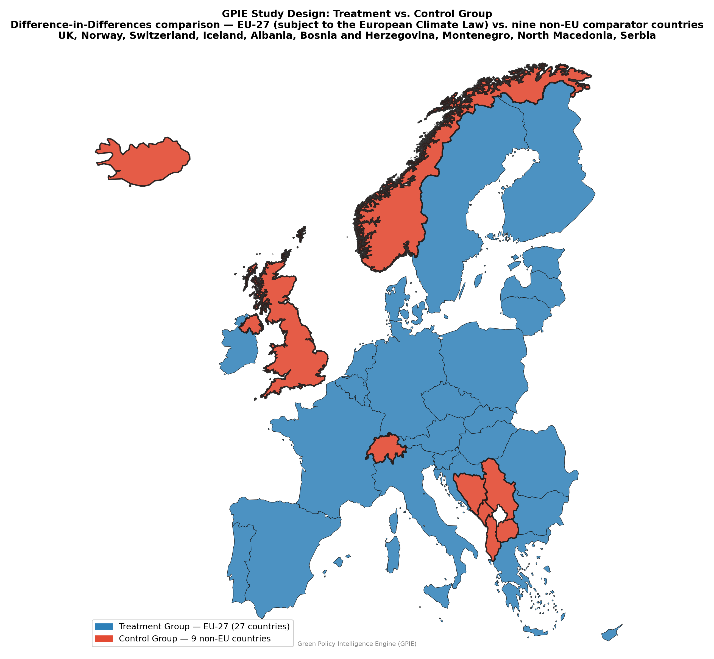

**Figure 1. Difference-in-Differences study design showing the treatment group (EU-27) and the nine-country non-EU control group (United Kingdom, Norway, Switzerland, Iceland, Albania, Bosnia and Herzegovina, Montenegro, North Macedonia, and Serbia).**

### 3.2 Data Sources

| Variable | Source | Resolution |
|---|---|---|
| NO₂ (outcome) | Sentinel-5P TROPOMI L2 (QA ≥ 0.75), via Sentinel Hub Process API: one 0.1° raster per day, pooled to monthly country means. Products served are the reprocessed (RPRO) v2.4.0 record to July 2022 and operational (OFFL) v2.4–2.7 afterwards | Monthly, country-level |
| NDVI (secondary outcome) | Copernicus Global Land Service 300 m dekadal NDVI, via Sentinel Hub Statistical API (ORBIT mosaicking, monthly means) | Monthly, country-level |
| Temperature, precipitation (controls) | ERA5 Reanalysis, Copernicus Climate Data Store | Monthly, country-level |
| GDP (control) | Eurostat (EU-27); World Bank (control group) | Annual, country-level |
| 10 m wind speed, boundary-layer height (robustness controls) | ERA5 Reanalysis monthly means | Monthly, country-level |
| COVID-19 stringency index (robustness control) | Oxford COVID-19 Government Response Tracker (Hale et al., 2021) | Daily, averaged to monthly; 34 of 36 countries |
| Administrative boundaries | Eurostat GISCO (NUTS, EU-27 plus Iceland/Albania/Bosnia and Herzegovina/Montenegro/North Macedonia/Serbia); GADM (UK, Norway, Switzerland) | — |
| Land cover, elevation (context only) | ESA WorldCover v200 (2021); Copernicus DEM GLO-30 | Static, country-level; absorbed by country fixed effects, not model regressors |

The panel spans January 2019 to December 2024 (72 months), providing 30 months of pre-treatment (January 2019 – June 2021) and 42 months of post-treatment (July 2021 – December 2024) observation; July 2021, the month of entry into force, is coded as the first post-treatment month. The intended frame is 36 × 72 = 2,592 country-months; 2,572 have an NO₂ value (the 20 missing months are polar-night winter months in Iceland, Finland, Norway and Estonia). GDP is annual and is repeated across the twelve months of each year.

### 3.3 Model Specification

For the final model the coefficient of interest is $\beta_1$;

$$NO2_{it} = \beta_0 + \beta_1 (Treatment_i \times Post_t) + \beta_2 Post_t + \gamma X_{it} + \alpha_i + \delta_m + \varepsilon_{it}$$

where $Treatment_i$ is a binary variable denoting whether an observation belongs to the treatment group (EU-27 member countries) or the control group (the nine-country non-EU control group), $Post_t$ is a binary that equals 1 from July 2021 onward, and X_{it} is a vector of time-varying controls (temperature, precipitation, GDP), while the country fixed effects and the calendar-month (month-of-year) fixed effects absorb respectively time-invariant country differences and seasonality. Because the model has no year or year-month fixed effects, common one-off shocks such as the 2020 COVID-19 lockdowns are not absorbed; they enter only through the comparison with the control group. $\beta_1$ denotes the EU-specific effect of the Climate Law, net of control group and treatment group trends. For panel data that contains repeated monthly observations over time within each country, all standard errors are clustered by country, because classical standard errors ignore within-country serial correlation and understate uncertainty (Bertrand, Duflo & Mullainathan, 2004). Country clustering does not address correlation between neighbouring countries; that is examined separately in Section 4.9. GDP is included as a control; since economic activity could itself respond to climate policy, a specification without GDP is reported in Section 4.7.

### 3.4 Robustness Checks

Robustness checks include a **placebo test**, in which the first (single-cohort) model is re-estimated on the full panel using an artificial treatment date (30 June 2020) at which no comparable policy change took place, and an **event-study specification**, which substitutes the one post-treatment indicator for 23 quarter-specific interaction terms (2019Q1–2024Q4, compared with a 2021Q2 reference quarter), testing the pre-treatment parallel trends assumption and also for possible delayed treatment effects.

A further set of **identification and inference checks** (Section 4.10) re-estimates the two-group model with year-month fixed effects in place of the single post-treatment indicator and with EU-specific calendar-month effects, so that the two groups may have different seasonal cycles; adds ERA5 wind speed and boundary-layer height and the Oxford COVID-19 stringency index as controls; excludes the COVID-19 and energy-crisis windows; replaces the quarterly event study with 12-month blocks relative to July 2021, which are not affected by seasonality; and, because only nine of the 36 clusters are comparison countries, reports a restricted wild cluster bootstrap (Cameron, Gelbach & Miller, 2008; 9,999 replications) and randomization inference (re-assigning the EU label to 27 randomly chosen countries, 2,000 draws; MacKinnon & Webb, 2020) alongside the cluster-robust p-values.

Finally, a **pixel-level check** (Section 4.11) keeps every daily 0.1° raster instead of only country totals (`download_no2_gridded.py`; country means rebuilt from the grid reproduce the country series exactly). Pixels are grouped into eight classes by their pre-treatment NO₂ level, and the two-group model is re-estimated on country × class × month cells with class-specific year-month fixed effects, so that EU pixels are compared only with comparison-group pixels that started at the same pollution level. Each country keeps the same total weight as in the country-level model.

### 3.5 Synthetic Control

DiD weights all comparison units equally. A synthetic control (Abadie, Diamond & Hainmueller, 2010) instead chooses non-negative donor weights that sum to one so that the weighted donor series tracks the EU-27's aggregate NO₂ series over the pre-treatment window (January 2019 – June 2021). The remaining mean pre-treatment gap is removed as a constant level (intercept) adjustment. An earlier version of this analysis described the method as an augmented synthetic control with a ridge bias correction (Ben-Michael, Feller & Rothstein, 2021); in practice the ridge term, fitted on raw NO₂ values of order 10⁻⁵, reduced to that constant shift, so the method is reported here as what it is. All nine comparison countries are donors. Only months in which the EU-27 aggregate and every donor are observed are used (27 pre-treatment and 36 post-treatment months; the dropped months are winter months with no valid Norwegian or Icelandic retrievals). An in-space placebo reassigns "treatment" to each donor in turn, refitting weights on the other eight.

### 3.6 Spatial Autocorrelation Diagnostics

An atmospheric pollutant naturally transcends national borders, and country-clustered standard errors (Section 3.3) do not account for correlation between neighbouring countries. All 36 country centroids were used to compute Global and Local Moran's I (Moran, 1950; Anselin 1995), using a K-nearest-neighbor spatial weights matrix (k=4) which was selected over Queen/Rook contiguity because several countries in the panel have no land neighbours in the sample (Cyprus, Malta and Iceland). The global Moran's I was calculated using the country averages of the pollution data for the period before the treatment and after the treatment, and on the DiD model's residuals month by month (each month's cross-section of residuals, with KNN-4 weights rebuilt on the countries observed that month), to see whether the model leaves cross-border dependence in its errors. Averaging residuals over the whole period is not informative here, because country fixed effects force each country's mean residual to zero; and the Local Moran's I (LISA) was calculated using the pre- and post-treatment averaged pollution data to determine which countries are responsible for spatial clustering identified through the global Moran's I.

## 4. Results

### 4.1 Initial Single-Cohort Model

The first model compared all 27 EU countries before and after the treatment date without an external comparison group. On the NO₂ data available at the time it found a significant decrease (coefficient = −2.29 × 10⁻⁶; p = 0.026 with classical standard errors, p = 0.041 with country-clustered standard errors). Those data were later found to be single end-of-month snapshots rather than monthly means (Section 6). Re-estimated on the corrected monthly means, the same single-cohort model gives −4.95 × 10⁻⁷ (p = 0.243, cluster-robust). Both versions are reproducible with `causal_inference_initial_model.py` (add `--corrected` for the corrected data).

### 4.2 Placebo Test

Moving the treatment date to 30 June 2020 produced a larger and more significant single-cohort "effect" than the real date — on the original data (−3.29 × 10⁻⁶, p = 0.004) and again on the corrected data (−1.64 × 10⁻⁶, p = 0.001). A single-cohort before/after design therefore cannot separate a policy-dated break from the continuing decline in European NO₂, and the study moved to an external comparison group. Adding a linear time trend to the single-cohort model points the same way (original data: p = 0.186; corrected data: the treatment term turns positive, +2.76 × 10⁻⁶).

### 4.3 Two-Group Model

With the nine-country comparison group, the DiD model gives:

| Statistic | Value |
|---|---|
| DiD coefficient | −1.52 × 10⁻⁶ |
| P-value (cluster-robust, by country) | 0.013 |
| 95% Confidence Interval | [−2.73 × 10⁻⁶, −3.16 × 10⁻⁷] |
| R² | 0.795 |
| N | 2,572 |

**Figure 2.** Raw mean NO₂ before (January 2019 – June 2021) and after (July 2021 – December 2024) the treatment cutoff for the EU-27 and the non-EU comparison group (descriptive). The EU-27 mean falls by about 5% (3.13 → 2.97 × 10⁻⁵ mol/m²) while the comparison-group mean is almost unchanged (2.08 → 2.07 × 10⁻⁵).

  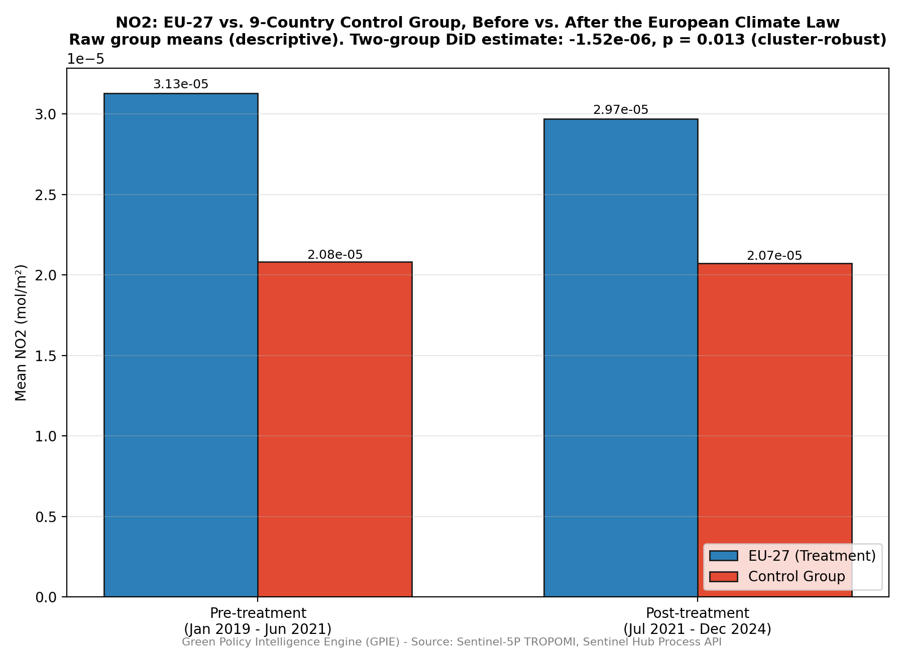

The interaction term is significant at the 5% level and corresponds to about 4.9% of the EU-27's pre-treatment mean. Whether it can be read as an effect of the Climate Law depends on the timing checks below (Sections 4.4 and 4.7), which it does not pass.

### 4.4 Event Study

The event study replaces the single post-treatment indicator with 23 EU × quarter terms relative to 2021Q2 (with quarter fixed effects). Seven of the nine pre-treatment quarters differ significantly from the reference quarter (p < 0.05), so the EU-27 and the comparison group were not moving in parallel before treatment. The pre-treatment coefficients follow a seasonal pattern — positive in the first and fourth quarters, negative in the second and third — which continues after treatment (8 of 14 post-treatment quarters significant, 6 of them negative). This is what one would expect if NO₂'s seasonal cycle is larger in the more polluted EU countries than in the comparison group, which the common calendar-month fixed effects cannot absorb. The event study therefore does not support the parallel-trends assumption, and the post-treatment quarters cannot be read as a dated policy response. The 23 coefficients come from one regression with a shared reference quarter, so they are not independent tests. Section 4.10 confirms the seasonal explanation: once EU-specific calendar-month effects are allowed, the pre-treatment differences are no longer significant.

**Figure 3.** Event-study estimates (EU × quarter, relative to 2021Q2) with cluster-robust 95% confidence intervals. Red points are significant at 5%.

  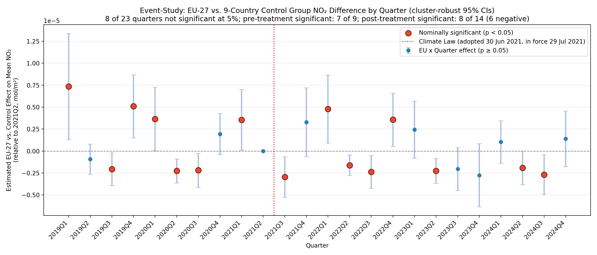

### 4.5 Secondary Outcome (NDVI)

The same two-group design applied to NDVI gives −0.0194 (p = 0.005, cluster-robust), 95% CI [−0.0330, −0.0058], N = 2,574: a significant relative decline in EU-27 NDVI. In the raw group means, NDVI rose in both groups between the two periods, but more in the comparison group (0.470 → 0.501) than in the EU-27 (0.542 → 0.551). On the original data the single-cohort NDVI model had given p = 0.128 with classical and p = 0.0017 with clustered standard errors.

**Figure 4.** Raw mean NDVI for the EU-27 and the comparison group, January 2019 – June 2021 vs. July 2021 – December 2024 (descriptive).

  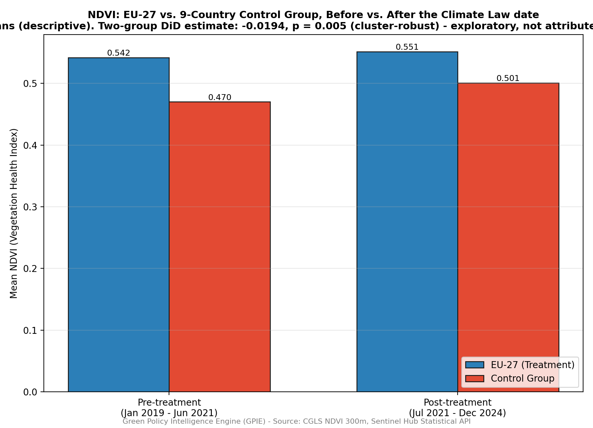

This result should not be read as evidence that the Climate Law affected vegetation. The Climate Law is an emissions-focused instrument, not a land-use policy; land-use change, drought or precipitation stress, and agricultural-policy differences between the two groups are not controlled for, and the same timing problems as for NO₂ apply. It is reported as an exploratory association.

**Figure 5.** Country-level average NDVI in 2019 and 2024 across the 36 study countries (descriptive).

  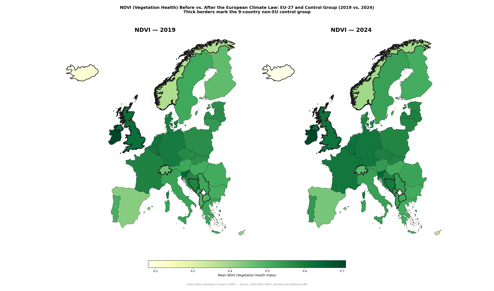

### 4.6 Transferability Test

To check that the acquisition step is not specific to Europe, the NO₂ method (same daily Process API requests, QA threshold and monthly pooling as the EU study) is run on India's national boundary (GADM 4.1 level 0), 2019–2024. The test script records how many months returned data and compares the values with the EU-27 country-month distribution (`data/global_transferability_test/india_no2_sanity_check.json`). Result: all 72 months returned data; India's monthly national mean ranged from 2.27 × 10⁻⁵ to 4.16 × 10⁻⁵ mol/m² (median 3.32 × 10⁻⁵), with no negative months, and all 72 values fall inside the 5th–95th percentile range of EU-27 country-months (1.34 × 10⁻⁵ to 6.34 × 10⁻⁵ mol/m²). An earlier version of this test used a rectangular bounding box (68–97.5° E, 6–37.5° N) that also covered neighbouring countries and ocean; that output is superseded. This is an acquisition test only; applying the causal design to India would require its own comparison group.

**Figure 6.** NO₂ monthly means over India's national boundary, 2019–2024, retrieved with the same method as the EU-27 study.

  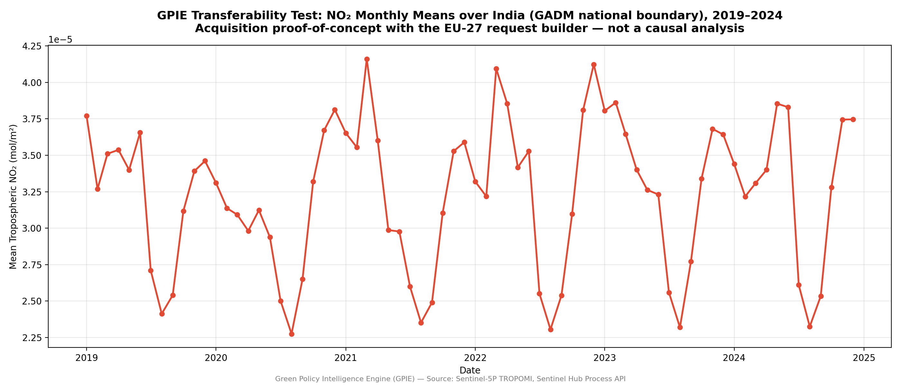

### 4.7 Additional Robustness Checks

**GDP excluded.** Removing GDP gives −1.49 × 10⁻⁶ (p = 0.053), almost the same coefficient as the headline. GDP could itself respond to policy, in which case controlling for it could absorb part of an effect (Angrist & Pischke, 2009); the near-identical coefficient shows the estimate is not sensitive to it. This is a sensitivity check, not a formal test of whether GDP is a "bad control".

**Log outcome.** Excluding the 8 of 2,572 country-months with non-positive values (winter months in Nordic and Baltic countries, where few valid retrievals exist), the log model gives −0.0418 (p = 0.034), a relative decline of about 4%.

**Treatment-date sensitivity.** Shifting the cutoff gives: −12 months (30 June 2020), −1.70 × 10⁻⁶, p = 0.028; −6 months, −1.14 × 10⁻⁶, p = 0.027; true date, −1.52 × 10⁻⁶, p = 0.013; +6 months, −1.39 × 10⁻⁶, p = 0.020; +12 months, −1.80 × 10⁻⁶, p = 0.004. Every date gives a significant estimate of similar size, including two dates before the Climate Law existed. By the logic used to reject the single-cohort model (Section 4.2), the two-group estimate does not identify a break at the Climate Law's date.

**EU-specific trend.** Adding a common linear trend and an EU-specific linear trend (the same diagnostic as in Section 4.2) changes the treatment term to +8.67 × 10⁻⁷ (p = 0.243), while the EU-specific trend is −7.9 × 10⁻⁷ mol/m² per year (p = 0.016). The relative decline is captured by a steady faster decline in the EU-27 over the whole period, not by a step at the treatment date.

**Heterogeneity by baseline pollution level (post-hoc).** Splitting the EU-27 at its median pre-treatment NO₂ level into 14 higher-baseline countries (AT, BE, CZ, DE, DK, FR, HU, IT, LU, MT, NL, PL, SI, SK) and 13 lower-baseline countries, each estimated against the full comparison group: higher-baseline −2.85 × 10⁻⁶ (p = 0.002; log −0.064, p = 0.006); lower-baseline +8.6 × 10⁻⁸ (p = 0.758; log −0.015, p = 0.409). The relative decline is concentrated in the more polluted member states on both scales. The split was chosen after seeing the pooled result and is defined by the outcome, and the same timing problems apply, so this describes where the relative decline occurred rather than what caused it.

**Minimum detectable effect.** At 80% power and α = 0.05, the design can detect a pooled effect of about 5.5% of the EU-27's pre-treatment mean NO₂ (3.13 × 10⁻⁵ mol/m²); the estimate is 4.9%. This uses the clustered standard error, which Section 4.9 suggests is too small.

### 4.8 Synthetic Control

With all nine comparison countries as donors (Section 3.5), the weights are Serbia 40.2%, Switzerland 31.5% and United Kingdom 28.3%, with the other six donors at zero. The pre-treatment fit error (RMSPE, 27 months) is 2.56 × 10⁻⁶ and the mean post-treatment gap (36 months) is −8.1 × 10⁻⁷, about one-third of the fit error. In the in-space placebo, gaps for untreated countries range from −3.85 × 10⁻⁶ (United Kingdom) to +1.48 × 10⁻⁶ (Switzerland), and the EU-27 gap ranks 5th of 10 by absolute size. The synthetic control finds no EU-27 gap that stands out from the variation among untreated countries.

**Figure 7.** Actual EU-27 NO₂ against the synthetic control (nine-country donor pool, intercept-adjusted), complete-data months only, with the gap shown below.

  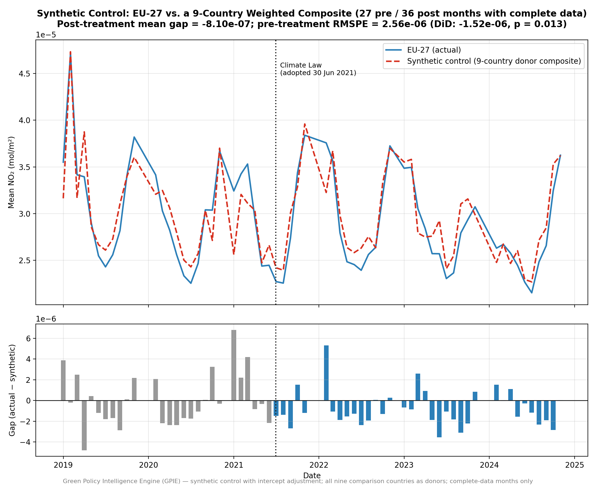

### 4.9 Spatial Autocorrelation Diagnostics

Global Moran's I on full-period average NO₂ across the 36 countries is 0.578 (p = 0.001, 999 permutations), and similar for the pre-treatment (0.594) and post-treatment (0.563) averages. Local Moran's I identifies a High-High cluster (Belgium, Germany, Luxembourg, the Netherlands, Switzerland, United Kingdom), a Low-Low cluster (Estonia, Finland, Sweden, Norway, Iceland), and Denmark and Ireland as Low-High outliers.

**Figure 8.** Local Moran's I (LISA) clusters for full-period average NO₂, 36 countries (descriptive).

  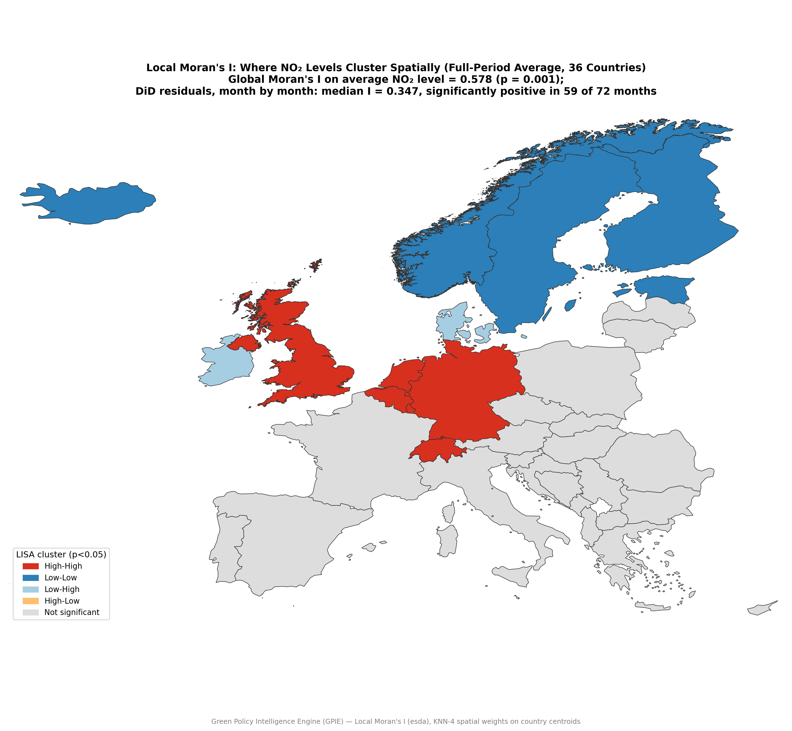

The spatial dependence carries through to the DiD residuals. Computed month by month on each month's cross-section, Moran's I on the residuals has a median of 0.347 and is significantly positive in 59 of 72 months. Neighbouring countries' errors are correlated, which country-clustered standard errors do not account for, so the p-values reported in this paper are likely too small. (An earlier version reported I = 0.069, p = 0.135 on country-averaged residuals; with country fixed effects those averages are exactly zero, so that test was uninformative.)

### 4.10 Identification and Inference Checks

These checks address four weaknesses of the model in Section 4.3: its common seasonal cycle, omitted meteorology, the small number of comparison clusters, and the COVID-19 and energy-price shocks that fall inside the study window.

| Specification | Coefficient (mol/m²) | p (cluster-robust) |
|---|---|---|
| Section 4.3 model (country FE, common calendar-month FE, post indicator) | −1.52 × 10⁻⁶ | 0.013 |
| Country FE + year-month FE | −1.53 × 10⁻⁶ | 0.013 |
| + EU-specific calendar-month effects (the "stricter specification") | −1.34 × 10⁻⁶ | 0.016 |
| Stricter specification + wind speed + boundary-layer height | −1.36 × 10⁻⁶ | 0.016 |
| Stricter specification + COVID-19 stringency (34 countries) | −1.48 × 10⁻⁶ | 0.014 |
| Stricter specification without GDP | −1.31 × 10⁻⁶ | 0.074 |
| Stricter specification without any controls | −1.30 × 10⁻⁶ | 0.080 |
| Stricter specification, log outcome | −0.030 | 0.061 |

**Specification.** The estimate is about −1.3 × 10⁻⁶ (4.3% of the EU pre-treatment mean) in every level specification. Boundary-layer height is itself strongly related to NO₂ (p < 0.001) but adding it and wind speed does not move the estimate, and the stringency index is not significant (p = 0.537) and does not move it either. Conventional significance, however, depends on the GDP control: without it the confidence interval includes zero (p = 0.074), and on the log scale p = 0.061.

**Timing.** With 12-month blocks relative to July 2021 (reference: July 2020–June 2021), the two pre-treatment blocks are not significant (January–June 2019: +1.93 × 10⁻⁶, p = 0.168; July 2019–June 2020: +1.5 × 10⁻⁷, p = 0.773; joint p = 0.292). The quarterly pre-treatment differences in Section 4.4 were therefore largely a seasonal artefact. The post-treatment blocks show no effect in the first two years (July 2021–June 2022: +1 × 10⁻⁸, p = 0.982; July 2022–June 2023: −5.1 × 10⁻⁷, p = 0.441) and a decline only afterwards (July 2023–June 2024: −2.18 × 10⁻⁶, p = 0.008; July–December 2024: −1.25 × 10⁻⁶, p = 0.137). Dropping 2023–2024 leaves −2.6 × 10⁻⁷ (p = 0.545). Shifted treatment dates remain significant under the stricter specification (−12 months: p = 0.041; −6: p = 0.031; +6: p = 0.019; +12: p = 0.007), and an EU-specific linear trend again absorbs the treatment term (+8.6 × 10⁻⁷, p = 0.275; trend −7.3 × 10⁻⁷ per year, p = 0.026). Placebo dates inside the pre-treatment period give p = 0.063 (31 January 2020), 0.381 (30 June 2020) and 0.894 (31 December 2020).

**Inference with few comparison clusters.** The wild cluster bootstrap gives p = 0.018, close to the cluster-robust value. Randomization inference gives p = 0.160 (0.139 for the Section 4.3 model): about one in six random assignments of the "EU" label to 27 of the 36 countries produces an estimate at least as large. The two methods answer different questions, and the estimate is significant under one and not the other. The estimate does not depend on any single comparison country (leave-one-out range −1.20 to −1.42 × 10⁻⁶, all p ≤ 0.025) and holds against both halves of the comparison group: Norway, Iceland, Switzerland and the United Kingdom (−1.59 × 10⁻⁶, p = 0.042) and the Western Balkans (−1.05 × 10⁻⁶, p = 0.027).

**COVID-19 and the energy crisis.** Excluding all of 2020 gives −2.10 × 10⁻⁶ (p = 0.009); excluding March 2020–June 2021 gives −2.25 × 10⁻⁶ (p = 0.011); excluding July 2021–December 2022, the months of the energy-price shock, gives −2.08 × 10⁻⁶ (p = 0.005). The relative decline is not produced by either period.

**Processor versions.** A check of 24 sample days (15 January, April, July and October of each year) shows that the values used in this study come from the reprocessed v2.4.0 record up to July 2022 and from operational v2.4.0–v2.7.1 products afterwards. The large processor change of 1 July 2021 (v1.4 to v2.2; van Geffen et al., 2022), which coincides with the treatment date, therefore does not affect the series. The smaller updates from 2023 onward apply to both groups, but a differential effect on more polluted scenes cannot be excluded with these data.

### 4.11 Pixel-Level Check: Baseline Pollution or EU Membership?

The heterogeneity result in Section 4.7 showed that the relative decline sits in the more polluted EU countries. The gridded data allow the same question to be asked below the country level: does NO₂ fall more where the EU is, or where pollution was high?

**Figure 9.** Change in NO₂ from July 2023 relative to the pre-treatment period, by the pixel's pre-treatment NO₂ level, for EU-27 and comparison-group pixels.

  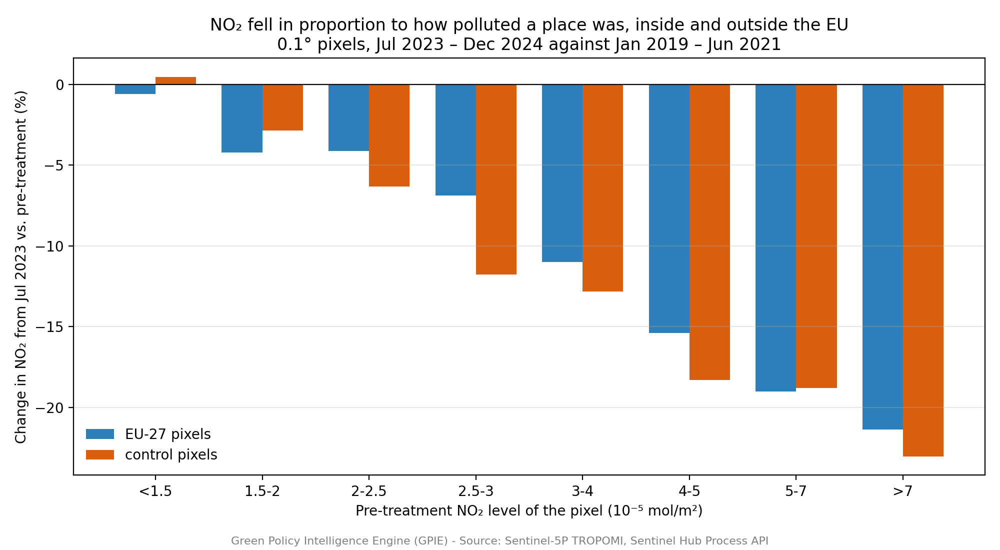

| Pre-treatment level (10⁻⁵ mol/m²) | EU-27 pixels | EU-27 change | Comparison pixels | Comparison change |
|---|---|---|---|---|
| < 1.5 | 2,560 | −0.6% | 2,130 | +0.5% |
| 1.5–2 | 8,087 | −4.2% | 1,701 | −2.9% |
| 2–2.5 | 8,335 | −4.1% | 1,229 | −6.3% |
| 2.5–3 | 7,003 | −6.9% | 717 | −11.8% |
| 3–4 | 7,264 | −11.0% | 765 | −12.8% |
| 4–5 | 5,459 | −15.4% | 580 | −18.3% |
| 5–7 | 2,999 | −19.0% | 762 | −18.8% |
| > 7 | 1,355 | −21.4% | 126 | −23.0% |

Changes are for July 2023–December 2024 against January 2019–June 2021, balanced by calendar month; 43,062 EU-27 and 8,010 comparison pixels have enough valid months in every period (high-latitude pixels drop out).

The decline grows steadily with the pre-treatment level in both groups, and at a given level the comparison-group pixels fell as much as the EU pixels, or more. Across all 51,072 pixels, the change is −0.247 per unit of pre-treatment NO₂ (p < 0.001; R² = 0.70): areas lost about a quarter of their pre-treatment level. Once that is accounted for, EU pixels do not differ from comparison pixels in level (+0.79 × 10⁻⁶, p = 0.221) or in slope (p = 0.828).

| Model (country × class × month cells) | EU × post (mol/m²) | p |
|---|---|---|
| Not matched on pre-treatment level | −1.34 × 10⁻⁶ | 0.012 |
| Matched on pre-treatment level (class × year-month fixed effects) | −0.21 × 10⁻⁶ | 0.341 |
| Matched, July 2021–June 2023 | −0.00 × 10⁻⁶ | 0.993 |
| Matched, from July 2023 | −0.52 × 10⁻⁶ | 0.221 |

Without matching, the cell-level model returns the country-level estimate of Section 4.10 (−1.34 × 10⁻⁶). With matching, about 84% of it disappears and what remains is not significant. Defining the classes from 2019 alone and estimating on 2020–2024, so that the classes and the estimation sample do not overlap, gives the same matched result (−0.20 × 10⁻⁶, p = 0.401).

The country-level estimate is therefore mostly a composition effect. EU countries contain many more highly polluted pixels than the comparison group, polluted pixels fell the most everywhere, and a country average turns that into an apparent EU effect.

**Figure 10.** Change in tropospheric NO₂ per 0.1° pixel, July 2023–December 2024 minus January 2019–June 2021.

  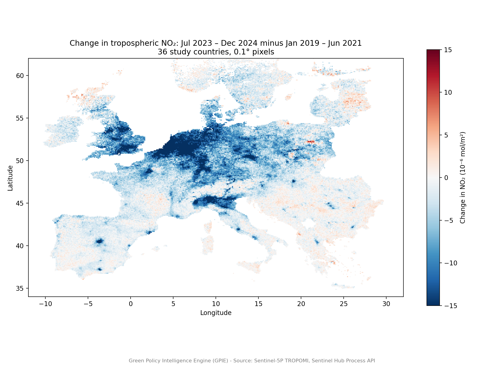

The map shows the same thing: the decline covers the polluted belt from England through the Low Countries and western Germany to the Po Valley, together with large cities, and it does not stop at the EU border.

One caveat matters for interpretation. The highly polluted comparison pixels (above 4 × 10⁻⁵ mol/m²) are almost all in the United Kingdom, with some in Switzerland and Serbia. The United Kingdom kept EU-derived vehicle and industrial emission standards after leaving the EU, so this check separates EU membership from pollution level, not EU-origin regulation from its absence.

## 5. Discussion

**Figure 11.** Country-level average tropospheric NO₂ column density in 2019 and 2024 for the 36 study countries (descriptive).

  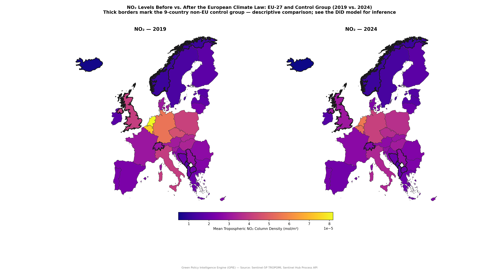

The corrected data show a clear descriptive pattern: NO₂ fell in the EU-27, most of all in its more polluted western and central member states (for example the Netherlands, Germany, Belgium and Luxembourg), while the Western Balkan comparison countries were almost flat. The pooled DiD estimate captures this difference. What the design cannot establish is that the difference was caused by the European Climate Law. The EU–comparison gap was already changing before 2021 (Section 4.4), any cutoff date between mid-2020 and mid-2022 yields a similar estimate (Section 4.7), and a steady EU-specific trend explains the data at least as well as a break at the treatment date. These are the same symptoms that led this study to reject its first, single-cohort model (Section 4.2).

The stricter specification in Section 4.10 sharpens this picture. Most of the pre-treatment differences disappear once the two groups are allowed their own seasonal cycles, and the estimate survives controls for ventilation and COVID-19 stringency and the exclusion of the COVID-19 and energy-crisis windows. But the timing still does not match the law: nothing changes in the two years after July 2021, and the whole estimate comes from July 2023 onward. A law that sets long-term targets could plausibly act with a delay, but a delay of two years with no dated mechanism is not something this design can attribute to it, and other measures that took effect in that period are equally consistent with the data.

The pixel-level check (Section 4.11) changes what the estimate means. NO₂ fell in proportion to how polluted a place was, and it fell the same way in comparison-group pixels with the same starting level. The country-level DiD compares the average of a heavily polluted group of countries with the average of a much cleaner one, so a decline that scales with pollution level appears as a difference between the groups. This is an aggregation problem, not a statistical-significance problem: none of the country-level checks in Sections 4.7–4.10 could have revealed it, because they all use country averages.

Several explanations are compatible with a gradual EU-specific decline: earlier EU air-quality and vehicle-emission standards continuing to take effect, faster fleet renewal and industrial change in western Europe, and specific measures taking effect from 2023. The COVID-19 lockdowns and the 2022 energy-price shock are less likely explanations, since excluding either window leaves the estimate in place (Section 4.10). The study does not distinguish between the remaining explanations, and the Climate Law — which sets long-term targets rather than immediate emission limits — may be only one small part of that broader policy environment.

The comparison group also has limits. Norway and Iceland participate in the EU ETS, Switzerland's ETS is linked to it, and the Western Balkans committed to align with the Green Deal (Section 3.1), so shared exposure would bias the estimate toward zero. On the other hand, the comparison group is structurally different from the EU-27 — lower NO₂ levels, a smaller seasonal cycle, and (in the Balkans) different economic trajectories — which is what the event study and trend checks pick up. The synthetic control, which can weight donors to resemble the EU-27, does not find an EU-27 gap that stands out from untreated countries (Section 4.8), and the spatially correlated residuals mean the clustered p-values overstate precision (Section 4.9).

The NDVI result has the same identification weaknesses and an additional problem of mechanism: the Climate Law is not a vegetation policy. It is reported as an exploratory association.

## 6. Limitations

**Satellite aggregation (corrected in this version).** An earlier version of this study retrieved NO₂ and NDVI through the Sentinel Hub Statistical API with monthly intervals and default SIMPLE mosaicking; in addition, the provider documents that Sentinel-5P requests are clipped to the last 24 hours of the requested range. Each "monthly" NO₂ value was therefore effectively a snapshot of the last day of the month. That explained the earlier patchy coverage (e.g. Luxembourg missing 25 of 72 months) and impossible values (negative country means across Europe on 31 December 2023). All results in this paper use the corrected acquisition: one Process API raster per day at 0.1° with QA ≥ 0.75, pooled into monthly means over all valid pixel-days; NDVI uses monthly means of the dekadal composites. With the corrected data, coverage gaps are confined to polar-night winter months, and only 8 country-months are non-positive (Nordic and Baltic winter months with few retrievals). Changing the data reversed several of the earlier conclusions, including the headline significance, which is why every number in this version differs from the previous one.

Further limitations: First, the unit of analysis. The country-level estimate is largely a composition effect of baseline pollution (Section 4.11); the matched pixel-level estimate is small and not significant, but its high-pollution comparison pixels come mostly from one country, the United Kingdom, which retained EU-derived emission standards. Second, identification. Significant estimates at every alternative date, the EU-specific trend (Sections 4.7 and 4.10) and the absence of any effect in the first two post-treatment years (Section 4.10) mean the design cannot attribute the relative decline to the Climate Law; conventional significance also depends on the GDP control. Third, the treatment date is tied to a single legal instrument; no country-differentiated measure of Green Deal intensity was available. Fourth, the comparison group shares some EU climate instruments (Section 3.1) and differs structurally from the EU-27; it has only nine clusters, which limits the reliability of cluster-robust inference (the wild cluster bootstrap agrees with the cluster-robust p-value but randomization inference does not, Section 4.10), and the residuals are spatially correlated (Section 4.9). Fifth, the NO₂ record combines reprocessed v2.4.0 products (to July 2022) with operational v2.4–2.7 products; the minor processor updates after 2023 fall in the period where the relative decline appears. Sixth, the country-level 0.1° grid represents Malta with only three pixels, so its values are noisy. Seventh, GDP for the comparison group was converted from US dollars at annual average exchange rates. Eighth, WorldPop population data were only available for 2019–2020 in the version accessed, so population is not used. Ninth, NDVI may reflect land-use change, drought stress or agricultural policy, none of which are controlled for; land cover is a single 2021 snapshot used only as descriptive context.

An originally planned ranking of interventions by cost-effectiveness was not pursued, because the analysis did not establish an NO₂ improvement attributable to a specific policy.

## 7. Future Work

The restrictions stated above indicate that there are a number of specific and clearly definable technical extensions which might have been developed but were deliberately excluded from this phase of the study rather than developed in an incomplete fashion.

The pixel-level check in Section 4.11 is a first step in this direction. Running the design at NUTS-2 regional resolution (or using fixed size grid-cells directly within the underlying TROPOMI pixel data and excluding a border buffer through some empirical rather than qualitative argument according to spillover-attenuation) would increase the effective sample size by a factor of approx. 10, significantly enhancing the statistical power of the study, and would also enable a border-buffer exclusion as a direct empirical test of the spillover-attenuation argument. It is necessary since the current analysis keeps the country-month granularity, further compounding the SUTVA risk discussed in Section 5 from regions neighbouring the border in larger member states and averaging away any regional difference/heterogeneity when computing the country-month level averages. It would also allow spatial-lag or spatial-error specifications, which the residual spatial dependence found at country level (Section 4.9) already motivates.

Policy effects that take a while to materialise and are cumulative. The event-study analysis (Section 4.4) only considers the impacts of some of the instruments in the Green Deal's range, and cannot comment on possible impacts from instruments that have been rolled out later, such as the "Fit for 55" legislative package. The following specific and testable extension to the work is to see whether the pattern discovered in each quarter of the post-treatment period (Section 4.4) is maintained, enhanced or diminished as further data can be obtained.

Solving heterogeneous effect (higher baseline). The design of this study would replicate the same design without introducing a new experimental manipulation; instead, it would directly compare the treatment effect with each country's baseline level, which goes back to the pre-treatment period (rather than splitting the baseline into a "less" and a "more" group as, for instance, a median split) and directly test for a similar effect at every baseline level, while simultaneously analyzing for a baseline-pollution-level effect in the treatment responses and testing for a sector-composition effect that would be likely to co-vary with the baseline-pre-treatment periods. This would test directly whether the relative decline concentrated in the 14 higher-baseline countries (Section 4.7) follows baseline pollution continuously, and whether it reflects policy or other structural change.

Testing more than one legal date (for example the 2019 Green Deal communication or the 2021 "Fit for 55" proposals), and the specific measures that took effect from 2023, when the relative decline appears (Section 4.10), would show more directly whether any part of it is linked to a dated policy change.

## 8. Conclusion

Measured with true monthly satellite means, NO₂ fell more in the EU-27 than in nine neighbouring non-EU countries between 2019 and 2024, by about 5% of the EU's pre-treatment level, and the decline was concentrated in the more polluted member states. The estimate holds under year-month fixed effects, group-specific seasonality, meteorological and COVID-19 controls, and a wild cluster bootstrap, though not under randomization inference or without the GDP control. This study cannot attribute that relative decline to the European Climate Law: nothing changes in the first two years after the law and the decline appears only from mid-2023, the estimate is just as large at dates when the law did not yet exist, and an EU-specific trend absorbs the treatment-date effect. At pixel level, NO₂ fell in proportion to each area's pre-treatment level, equally inside and outside the EU, and comparing areas with the same starting level removes most of the estimate (−0.21 × 10⁻⁶, p = 0.341): the country-level result is largely a composition effect. A synthetic control does not distinguish the EU-27 from untreated countries, and spatially correlated residuals mean the reported p-values are, if anything, too small.

The project's methodological lessons come from the corrections it went through. A single-cohort before/after design produced a significant estimate that a placebo date showed it could not attribute to the policy. Later, the satellite aggregation itself turned out to be a single end-of-month snapshot rather than a monthly mean, and correcting it changed the headline result. Finally, an estimate that survived every country-level check turned out to depend on comparing countries with very different pollution levels. The corrections point the same way: claims about a policy's effect need checks on timing, on the data pipeline and on the unit of analysis, not just on statistical significance.

The acquisition step has been run outside Europe (India, Section 4.6), so the data pipeline can be reused elsewhere; transferring the causal design would require a suitable comparison group in each new setting.

## References

Abadie, A., Diamond, A., & Hainmueller, J. (2010). Synthetic Control Methods for Comparative Case Studies: Estimating the Effect of California's Tobacco Control Program. *Journal of the American Statistical Association*, 105(490), 493–505. [https://doi.org/10.1198/jasa.2009.ap08746](https://doi.org/10.1198/jasa.2009.ap08746)

Angrist, J. D., & Pischke, J.-S. (2009). *Mostly Harmless Econometrics: An Empiricist's Companion*. Princeton University Press. [https://doi.org/10.1515/9781400829828](https://doi.org/10.1515/9781400829828)

Anselin, L. (1995). Local Indicators of Spatial Association—LISA. *Geographical Analysis*, 27(2), 93–115. [https://doi.org/10.1111/j.1538-4632.1995.tb00338.x](https://doi.org/10.1111/j.1538-4632.1995.tb00338.x)

Barré, J., Petetin, H., Colette, A., Guevara, M., Peuch, V.-H., Rouil, L., et al. (2021). Estimating lockdown-induced European NO2 changes using satellite and surface observations and air quality models. *Atmospheric Chemistry and Physics*, 21(9), 7373–7394. [https://doi.org/10.5194/acp-21-7373-2021](https://doi.org/10.5194/acp-21-7373-2021)

Ben-Michael, E., Feller, A., & Rothstein, J. (2021). The Augmented Synthetic Control Method. *Journal of the American Statistical Association*, 116(536), 1789–1803. [https://doi.org/10.1080/01621459.2021.1929245](https://doi.org/10.1080/01621459.2021.1929245)

Bertrand, M., Duflo, E., & Mullainathan, S. (2004). How Much Should We Trust Differences-in-Differences Estimates? *The Quarterly Journal of Economics*, 119(1), 249–275. [https://doi.org/10.1162/003355304772839588](https://doi.org/10.1162/003355304772839588)

Callaway, B., & Sant'Anna, P. H. C. (2021). Difference-in-Differences with multiple time periods. *Journal of Econometrics*, 225(2), 200–230. [https://doi.org/10.1016/j.jeconom.2020.12.001](https://doi.org/10.1016/j.jeconom.2020.12.001)

Cameron, A. C., Gelbach, J. B., & Miller, D. L. (2008). Bootstrap-Based Improvements for Inference with Clustered Errors. *The Review of Economics and Statistics*, 90(3), 414–427. [https://doi.org/10.1162/rest.90.3.414](https://doi.org/10.1162/rest.90.3.414)

Fredriksson, A., & de Oliveira, G. M. (2019). Impact evaluation using Difference-in-Differences. *RAUSP Management Journal*, 54(4), 519–532. [https://doi.org/10.1108/RAUSP-05-2019-0112](https://doi.org/10.1108/RAUSP-05-2019-0112)

Goodman-Bacon, A. (2021). Difference-in-differences with variation in treatment timing. *Journal of Econometrics*, 225(2), 254–277. [https://doi.org/10.1016/j.jeconom.2021.03.014](https://doi.org/10.1016/j.jeconom.2021.03.014)

Hale, T., Angrist, N., Goldszmidt, R., Kira, B., Petherick, A., Phillips, T., et al. (2021). A global panel database of pandemic policies (Oxford COVID-19 Government Response Tracker). *Nature Human Behaviour*, 5, 529–538. [https://doi.org/10.1038/s41562-021-01079-8](https://doi.org/10.1038/s41562-021-01079-8)

MacKinnon, J. G., & Webb, M. D. (2020). Randomization inference for difference-in-differences with few treated clusters. *Journal of Econometrics*, 218(2), 435–450. [https://doi.org/10.1016/j.jeconom.2020.04.024](https://doi.org/10.1016/j.jeconom.2020.04.024)

Mathew, A., Shekar, P. R., Nair, A. T., Mallick, J., Rathod, C., Bindajam, A. A., Alharbi, M. M., & Abdo, H. G. (2024). Unveiling urban air quality dynamics during COVID-19: a Sentinel-5P TROPOMI hotspot analysis. *Scientific Reports*, 14, 21624. [https://doi.org/10.1038/s41598-024-72276-4](https://doi.org/10.1038/s41598-024-72276-4)

Moran, P. A. P. (1950). Notes on Continuous Stochastic Phenomena. *Biometrika*, 37(1/2), 17–23. [https://doi.org/10.2307/2332142](https://doi.org/10.2307/2332142)

Riveros-Gavilanes, J. M. (2023). Testing Parallel Trends in Differences-in-Differences and Event Study Designs: A Research Approach Based on Pre-Treatment Period Significance. *Journal of Research, Innovation and Technologies*, 2(2), 226–237. [https://doi.org/10.57017/jorit.v2.2(4).07](https://doi.org/10.57017/jorit.v2.2(4).07)

Roth, J., Sant'Anna, P., Bilinski, A., & Poe, J. (2023). What's Trending in Difference-in-Differences? A Synthesis of the Recent Econometrics Literature. *Journal of Econometrics*, 235(2), 2218–2244. [https://doi.org/10.1016/j.jeconom.2023.03.008](https://doi.org/10.1016/j.jeconom.2023.03.008)

Tong, C., Dai, Y., Cole, M., Elliott, R. J. R., Bartington, S. E., Liu, B., & Shi, Z. (2025). Further improvement in London's air quality demands more than the Ultra Low Emission Zone policy. *npj Clean Air*, 1, 29. [https://doi.org/10.1038/s44407-025-00030-9](https://doi.org/10.1038/s44407-025-00030-9)

van Geffen, J., Eskes, H., Compernolle, S., Pinardi, G., Verhoelst, T., Lambert, J.-C., et al. (2022). Sentinel-5P TROPOMI NO₂ retrieval: impact of version v2.2 improvements and comparisons with OMI and ground-based data. *Atmospheric Measurement Techniques*, 15(7), 2037–2060. [https://doi.org/10.5194/amt-15-2037-2022](https://doi.org/10.5194/amt-15-2037-2022)

Vîrghileanu, M., Săvulescu, I., Mihai, B.-A., Nistor, C., & Dobre, R. (2020). Nitrogen Dioxide (NO2) Pollution Monitoring with Sentinel-5P Satellite Imagery over Europe during the Coronavirus Pandemic Outbreak. *Remote Sensing*, 12(21), 3575. [https://doi.org/10.3390/rs12213575](https://doi.org/10.3390/rs12213575)

Wang, G., Hamad, R., & White, J. S. (2024). Advances in Difference-in-Differences Methods for Policy Evaluation Research. *Epidemiology*, 35(5), 628–637. [https://doi.org/10.1097/EDE.0000000000001755](https://doi.org/10.1097/EDE.0000000000001755)

----------------------------------------------------------------------------------------------------

**Full dataset, code, and reproducible pipeline**: [github.com/sakshimaske303-commits/GPIE](https://github.com/sakshimaske303-commits/GPIE)
**Live interactive dashboard**: [f5cf6fijj9gm564r6aapt6.streamlit.app](https://f5cf6fijj9gm564r6aapt6.streamlit.app/)
